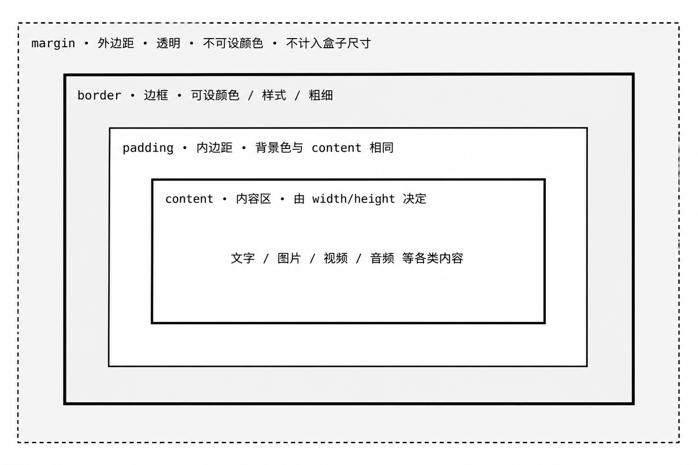
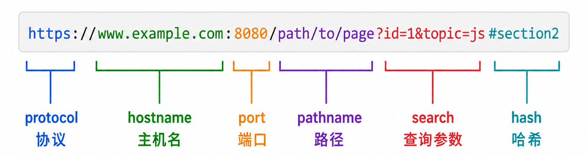

# 前端三件套 + Vue 全流程实战向导

**前端三件套**（HTML + CSS + JavaScript）是构建 Web 页面的基础技术栈，**Vue.js** 是目前最流行的渐进式 JavaScript 框架之一（vuejs/vue GitHub ⭐ 200k+，vuejs/core GitHub ⭐ 50k+，官方仓库：[https://github.com/vuejs/core](https://github.com/vuejs/core)）。
本向导以 **Vue 2 Options API** 为主线，同时标注 Vue 3 差异，
所有 API 均已与官方仓库（[https://github.com/vuejs/core](https://github.com/vuejs/core) / [https://github.com/vuejs/vue](https://github.com/vuejs/vue)）对照验证。

> **版本说明（重要）**：
> - **Vue 2**（当前主线）：最终版为 **2.7.16**，已于 **2023-12-31 正式 EOL**，不再维护。
>   当前内容基于 Vue 2 Options API，仍可学习和运行，但新项目请迁移至 Vue 3。
> - **Vue 3**（生产推荐）：当前稳定版为 **3.5.40**（2026-07-16），3.6.0 RC 阶段。
>   官方文档：[https://cn.vuejs.org/](https://cn.vuejs.org/)
> - **Vue CLI**（当前使用）：已进入 **Maintenance Mode（仅维护不新增功能）**。
>   新 Vue 3 项目官方推荐使用 `npm create vue@latest`（基于 Vite）。
> - **Node.js**：需 **v22.23.2 LTS（Maintenance）或 v24.18.1 LTS（Active，推荐）**；
>   Node 14/16/18/20 均已 EOL，`npm install -g @vue/cli` 需 Node.js ≥ 10，建议 ≥ 22。

> **核心理念**：HTML 决定结构，CSS 决定样式，JavaScript 决定行为，Vue 基于 **MVVM** 模式
> 将数据与视图通过 **双向绑定** 连接，实现声明式、组件化的前端开发方式。


| 章节 | 内容 |
| ---- | ---- |
| 一   | 前端开发概述：三件套职责划分、前后端分离架构、环境安装与工具链 |
| 二   | HTML 基础：文档结构、语义化标签、块/行内元素、图片与链接 |
| 三   | HTML 表格与表单：table 布局、表单控件全集、GET/POST 提交 |
| 四   | CSS 基础：三种引入方式、选择器六类、颜色表示法、文本样式属性、背景属性 |
| 五   | CSS 盒模型：content/padding/border/margin、实际尺寸计算、溢出与清除 |
| 六   | CSS 布局：浮动排版、清除浮动三法、定位四种类型、z-index 层级 |
| 七   | JavaScript 基础：嵌入方式、变量类型、函数定义与预解析、作用域 |
| 八   | JavaScript DOM 操作：获取元素两法、属性读写、innerHTML、事件绑定 |
| 九   | JavaScript 进阶：数组操作、循环语句、字符串方法、定时器、BOM 对象 |
| 十   | Vue 概述与环境搭建：MVVM 模型、Vue CLI（Maintenance Mode）、create-vue + Vite（推荐）、项目目录结构 |
| 十一 | Vue 指令系统：v-html/text/bind/if/show/for/on/model 及修饰符 |
| 十二 | Vue 组件化开发：单文件组件、数据/方法/计算属性/监听器/生命周期 |
| 十三 | Vue 组件通信：props 父→子、$emit 子→父、具名插槽与作用域插槽 |
| 十四 | Vue 进阶特性：动态组件 keep-alive、自定义指令、过滤器、CSS 过渡与动画 |
| 十五 | Vue Router：前端路由配置、嵌套路由、路由传参、编程式导航、导航守卫（beforeEach/afterEach/meta）|
| 十六 | Vuex 状态管理：state/mutations/actions/getters、跨组件数据共享 |
| 十七 | Axios 异步请求：GET/POST、拦截器、跨域代理、Mock 数据模拟 |
| 十八 | **完整端到端实战（新闻资讯 SPA，一键跑通）**：从项目初始化到路由、组件、接口对接，直至打包部署的完整闭环 |
| 十九 | 全章核心知识点梳理、前端开发完整流程图与常用命令速查表 |


---

## 一、前端开发概述与环境搭建

### 1.1 前端三件套职责划分

```
用户请求页面
   ↓ 浏览器下载 HTML / CSS / JS 文件
   ↓ 渲染引擎解析 HTML → 构建 DOM 树（骨架）
   ↓ 渲染引擎解析 CSS  → 构建样式规则（装饰）
   ↓ JS 引擎执行 JS    → 动态操作 DOM/CSS（行为）
最终呈现给用户的交互式页面
```

| 技术          | 职责            | 类比       |
| ------------- | --------------- | ---------- |
| HTML          | 页面结构与内容  | 房屋骨架   |
| CSS           | 页面样式与排版  | 装修与家具 |
| JavaScript    | 页面行为与交互  | 水电暖控制 |
| Vue.js        | 数据驱动视图    | 智能家居系统 |

### 1.2 前后端分离架构

```
前端服务器（Node.js/Nginx）          后端服务器（Django/Flask/...）
 ┌──────────────────────┐              ┌──────────────────────┐
 │  Vue SPA 项目         │  HTTP/HTTPS  │  REST API 接口        │
 │  (HTML+CSS+JS 打包)   │ ←──axios──→  │  返回 JSON 数据       │
 │  端口: 8080           │              │  端口: 8000           │
 └──────────────────────┘              └──────────────────────┘
用户浏览器请求前端，前端通过 Ajax 向后端获取数据，后端只负责数据
```

### 1.3 安装 Node.js 与 Vue CLI

```bash
# ============================================================
# 第一步：安装 Node.js（包含 npm 包管理器）
# 官网下载：https://nodejs.org/en/
# 当前 LTS 版本（2026-08）：
#   - Node.js 24.18.1（Active LTS，Krypton，推荐新项目，支持至 2028-04-30）
#   - Node.js 22.23.2（Maintenance LTS，Jod，支持至 2027-04-30）
# Node.js 26.x 为 Current 版本，预计 2026-10 转 Active LTS
# Node 14/16/18/20/25 均已 EOL，请勿在生产环境使用
# ============================================================

# 验证 Node.js 与 npm 安装成功
node -v           # 打印 Node.js 版本，推荐 v24.18.1 或 v22.23.2
npm -v            # 打印 npm 版本，如 10.x.x

# ============================================================
# 第二步：安装 cnpm（淘宝镜像，国内加速，可选）
# ============================================================
npm install -g cnpm --registry=https://registry.npmmirror.com

# ============================================================
# 第三步（当前方式 A）：安装旧版 vue-cli（用于 vue init webpack）
# ⚠️  vue-cli（包名 vue-cli）已废弃，仅用于复现旧版 Vue 2 环境
# 注意：这是旧版 CLI，与下方 @vue/cli 是两个不同的包
# ============================================================
npm install -g vue-cli            # 安装旧版 vue-cli，提供 vue init 命令

# ============================================================
# 第三步（当前方式 B）：安装新版 @vue/cli（已进入 Maintenance Mode）
# ⚠️  @vue/cli 已停止新功能开发，仅维护；提供 vue create 命令
# ============================================================
npm install -g @vue/cli           # 安装 Vue CLI（@vue/cli 4.x/5.x）

# 验证 Vue CLI 安装
vue --version                     # 打印已安装 CLI 的版本号

# ============================================================
# 第三步（生产推荐）：使用 create-vue + Vite 创建 Vue 3 项目
# 这是 Vue 3 官方推荐的脚手架工具（https://github.com/vuejs/create-vue）
# ============================================================
npm create vue@latest             # 交互式选择 TypeScript / Router / Pinia 等

# ============================================================
# 补充：在已有项目中单独安装 Vue 3
# 适用于手动搭建项目或已有项目升级/引入 Vue 3 依赖
# ============================================================
npm install vue@3                 # 安装最新的 Vue 3.x 版本到当前项目
```

### 1.4 创建 Vue 项目

```bash
# ============================================================
# 方式一（当前 / Vue 2 项目）：使用旧版 vue-cli（vue init webpack）
# ⚠️  vue-cli（不是 @vue/cli）已废弃，仅用于复现当前环境
# 此命令需要 npm install -g vue-cli（旧版 CLI，非 @vue/cli）
# ============================================================
vue init webpack my-project       # 初始化名为 my-project 的 Vue2 项目

cd my-project                     # 进入项目根目录
npm install                       # 安装所有依赖包（生成 node_modules/）
npm run dev                       # 启动开发服务器，访问 http://localhost:8080

# ============================================================
# 方式二（Vue 2 / 3 兼容）：使用 @vue/cli（vue create）
# ⚠️  @vue/cli 已进入 Maintenance Mode，仍可使用但不推荐新项目
# ============================================================
vue create my-vue2-project        # 交互式选择 Vue 2 + Babel + ESLint 等
cd my-vue2-project
npm run serve                     # 启动开发服务器（新版命令）
npm run build                     # 构建生产版本，输出到 dist/ 目录

# ============================================================
# 方式三（Vue 3 生产推荐）：使用 create-vue + Vite
# 官方仓库：https://github.com/vuejs/create-vue
# ============================================================
npm create vue@latest             # 交互式选择 TypeScript / Pinia / Router / Vitest 等
cd <project-name>
npm install
npm run dev                       # 启动 Vite 开发服务器（极速热更新）
npm run build                     # 构建生产版本
```

---

## 二、HTML 基础

### 2.1 HTML 概述与文档结构

HTML（HyperText Mark-up Language，超文本标记语言）是构建网页的基础语言，
一个 HTML 文件就是一个网页，浏览器负责解析标签并将其渲染成可视化页面。

> **CSS 引入方式说明**：在 HTML 中引入 CSS 共有三种方式，优先级从高到低依次为：
>
> | 方式 | 写法 | 作用范围 | 适用场景 |
> | ---- | ---- | -------- | -------- |
> | 行内（`style` 属性） | `<p style="color: red;">` 写在标签上 | 仅当前标签生效 | 极少量样式覆盖 |
> | 内嵌（`<style>`） | `<style> p { color: red; } </style>` 写在 `<head>` 内 | 仅当前页面生效 | 单页面或临时调试 |
> | 外联（`<link>`） | `<link rel="stylesheet" href="main.css">` | 多页面共享，浏览器可缓存 | 正式项目，**推荐** |
>
> 三种方式可同时存在，**行内 > 内嵌 > 外联**（相同选择器权重时，后声明的覆盖先声明的）。

```html
<!-- DOCTYPE 声明：通知浏览器使用 HTML5 标准解析本文档；实际项目中应为文件第一行 -->
<!DOCTYPE html>

<!-- <html> 根标签：整个 HTML 文档的最外层容器，所有内容必须写在其内部 -->
<!-- lang="zh-CN"：声明页面主要语言为简体中文；
     作用①：SEO（搜索引擎优化），帮助搜索引擎识别语言；
     作用②：辅助技术（如屏幕阅读器）正确发音；
     其他常用值：lang="en"（英文）、lang="zh-TW"（繁体中文） -->
<html lang="zh-CN">

<head>
    <!-- <head> 区域：文档头部，存放元信息，内容不显示在页面上，但影响浏览器行为和 SEO -->

    <!-- <meta charset>：声明文档字符编码；
         UTF-8 是 Unicode 万国码，支持中文、日文、韩文及各种特殊符号；
         若缺少此声明，中文内容在部分浏览器中会显示为乱码；
         必须放在 <head> 内尽可能靠前的位置 -->
    <meta charset="UTF-8">

    <!-- <meta name="viewport">：控制移动端视口（可视区域）行为，实现响应式布局的基础配置；
         width=device-width：将视口宽度设为设备屏幕实际宽度（而非默认 980px）；
         initial-scale=1.0：页面初始缩放比例为 1（不缩放，保持 CSS 像素与设备像素 1:1）；
         可追加属性：maximum-scale=1.0（禁止放大）、user-scalable=no（禁止用户手动缩放，部分场景不推荐） -->
    <meta name="viewport" content="width=device-width, initial-scale=1.0">

    <!-- <title>：网页标题；
         显示在浏览器标签页、书签名称、搜索引擎结果标题中；
         每个页面应有唯一且描述性强的标题，建议长度 25~30 个汉字以内 -->
    <title>网页标题</title>

    <!-- <link>：引入外部资源，最常用于引入 CSS 样式文件；
         rel="stylesheet"：声明引入的是样式表（relationship 关系类型）；
         type="text/css"：资源 MIME 类型，HTML5 中可省略（浏览器默认识别）；
         href="css/main.css"：外部 CSS 文件的路径（支持相对路径和绝对路径） -->
    <link rel="stylesheet" type="text/css" href="css/main.css">

    <!-- <script>：引入外部 JavaScript 文件；
         type="text/javascript"：脚本 MIME 类型，HTML5 中可省略；
         src="js/index.js"：外部 JS 文件路径（支持相对路径或网络 URL）；
         放在 <head> 中会阻塞页面渲染，推荐放在 </body> 前或使用 defer/async 属性；
         defer：延迟到 HTML 解析完成后执行，不阻塞渲染；
         async：异步加载，加载完立即执行，顺序不保证 -->
    <script type="text/javascript" src="js/index.js"></script>
</head>

<body>
    <!-- <body> 区域：文档主体，所有在页面上可见的内容都写在这里；
         浏览器从上到下解析并渲染 body 内的标签，最终呈现为用户可见的页面 -->
    网页显示内容
</body>

</html>
```

### 2.2 文档类型

| 文档类型    | 声明方式              | 说明                              |
| ----------- | --------------------- | --------------------------------- |
| HTML5       | `<!DOCTYPE html>`     | 当前主流，向下兼容，推荐使用      |
| XHTML 1.0   | 完整 DTD 声明         | 老版本，部分遗留网站仍在使用      |

### 2.3 常用双标签

```html
<!-- ============================================================
   块元素（Block Element）：默认占一整行，支持全部样式属性
   ============================================================ -->
<h1>一级标题</h1>               <!-- 标题标签，h1~h6 六个级别，h1 最大 -->
<h2>二级标题</h2>
<p>段落内容</p>                  <!-- 段落标签，自带上下外边距 -->
<div>块容器</div>                <!-- 无语义块容器，最常用的布局标签 -->
<ul>                            <!-- 无序列表（Unordered List），子项前有圆点 -->
    <li>列表项一</li>            <!-- List Item，块元素（display: list-item），每个列表项独占一行 -->
    <li>列表项二</li>
</ul>
<ol>                            <!-- 有序列表（Ordered List），子项前有数字序号 -->
    <li>第一步</li>
    <li>第二步</li>
</ol>
<dl>                            <!-- 描述列表（Description List） -->
    <dt>HTML</dt>               <!-- 描述术语（Description Term），块元素 -->
    <dd>负责页面结构</dd>        <!-- 术语的解释（Description Details），块元素，默认有左缩进 -->
</dl>
<!-- ============================================================
   HTML5 语义化布局标签（块元素）：与 div 功能相同，但具有明确语义，
   利于 SEO 和屏幕阅读器，推荐替代纯 div 布局
   ============================================================ -->
<header>页头区域</header>        <!-- 页面或区块的头部，通常放 Logo、导航 -->
<nav>导航区域</nav>              <!-- 导航链接集合（Navigation） -->
<main>主体内容</main>            <!-- 页面核心内容，一个页面只用一次 -->
<section>内容分区</section>      <!-- 独立的内容块，通常有标题 -->
<article>文章内容</article>      <!-- 可独立分发的完整内容，如博客文章 -->
<aside>侧边栏</aside>            <!-- 与主内容相关但可独立的辅助内容 -->
<footer>页脚区域</footer>        <!-- 页面或区块的底部，通常放版权、联系方式 -->

<!-- ============================================================
   媒体标签（块元素）
   ============================================================ -->
<!-- video：视频播放标签；src：视频地址（支持相对路径或网络 URL）；controls：显示播放控件；
     autoplay：自动播放（需配合 muted 才能在大多数浏览器生效）；
     loop：循环播放；width/height：播放器尺寸 -->
<video src="movie.mp4" controls autoplay muted loop width="640" height="360"></video>
<!-- audio：音频播放标签；src：音频地址（支持相对路径或网络 URL）；controls：显示播放控件；
     autoplay：自动播放；loop：循环播放 -->
<audio src="music.mp3" controls></audio>

<!-- ============================================================
   代码展示标签 —— pre 为块元素，code 为行内元素
   ============================================================ -->
<!-- pre（Preformatted Text）：块元素，保留原始空白和换行，
     单独用 code 时浏览器会压缩空白，需嵌套在 pre 内才能正确显示多行代码 -->
<pre>
<!-- code：行内元素，标记一段代码片段；
     class="language-xxx"：通行约定（W3C 推荐），用于标注代码语言类型，
     供 Prism.js、highlight.js 等高亮库识别并着色；
     单行代码可单独使用 code，无需 pre -->
<code class="language-javascript">const msg = 'hello'</code>
</pre>

<!-- ============================================================
   行内块元素（Inline-Block Element）：不独占一行，但可设置宽高
   ============================================================ -->
<!-- button：行内块元素，可包含文字或图标；
     type="button"：普通按钮（不触发表单提交）；
     type="submit"：提交按钮，提交目标地址由所在 <form> 的 action 属性决定；
     type="reset"：重置按钮，将表单所有控件恢复为默认值 -->
<button type="button">点击按钮</button>

<!-- ============================================================
   行内元素（Inline Element）：不换行，宽高由内容决定
   ============================================================ -->
<span>行内容器</span>            <!-- 无语义行内容器，常用于局部样式控制 -->
<!-- a 标签（Anchor）：超链接；href 跳转地址；title 鼠标悬停提示；
     target="_self"（默认，原页面跳转）；target="_blank"（新标签页打开）
     href="#" 表示链接到页面顶部，常用于占位 -->
<a href="https://vuejs.org" title="Vue官网" target="_blank">Vue 官网</a>
<i>斜体文字</i>                  <!-- italic：专业词汇斜体 -->
<b>粗体文字</b>                  <!-- bold：关键字粗体 -->
<em>强调文字</em>                <!-- emphasis：带语气强调，显示为斜体 -->
<strong>重要文字</strong>        <!-- 非常重要的内容，显示为粗体 -->
<!-- iframe：行内元素，在当前页面内嵌入另一个 HTML 文档；
     src：嵌入页面的 URL；width/height：显示尺寸；
     frameborder="0"：隐藏边框（HTML5 中已废弃，推荐用 CSS border: none 替代）；
     scrolling="no"：禁止滚动条（HTML5 已废弃属性，推荐用 CSS overflow: hidden 替代） -->
<iframe src="https://www.baidu.com" width="900" height="400"
    frameborder="0" scrolling="no" style="border: none; overflow: hidden;"></iframe>
```

### 2.4 常用单标签

```html
<!-- ============================================================
   块元素（Block Element）：默认占一整行
   ============================================================ -->
<hr>                             <!-- 水平分割线（Horizontal Rule），块元素 -->

<!-- ============================================================
   行内块元素（Inline-Block Element）：不独占一行，但可设置宽高
   ============================================================ -->
<!-- img：图片标签（Image），行内块元素；
     src：图片路径（支持相对路径或网络 URL；相对路径：./ 当前目录，../ 上级目录）；
     alt：图片加载失败时显示的替代文字（SEO 重要，盲人读屏使用）；
     width/height：图片显示尺寸；仅设其中一个，另一个由浏览器等比缩放；
     同时设置两个且比例与原图不同时会拉伸变形 -->


<!-- ============================================================
   行内元素（Inline Element）：不换行，宽高由内容决定
   ============================================================ -->
<br>                             <!-- 换行（Break），行内元素，强制换行 -->
<!-- input：表单输入控件，行内元素，单标签；
     type 决定控件类型：text 文本框、password 密码框、radio 单选、
     checkbox 复选、file 文件上传、submit 提交按钮等；
     详细用法见 3.2 表单标签 -->
<input type="text" name="username"/>
```

### 2.5 字符实体

```html
&nbsp;     <!-- 不换行空格（Non-Breaking Space）；宽度与普通空格相同，
             特性①：不会被浏览器折叠（多个 &nbsp; 均可见，普通空格连续写只渲染为一个）；
             特性②：该位置不允许自动换行 -->
&lt;       <!-- 小于号 < （lower than）；防止被识别为标签开始符 -->
&gt;       <!-- 大于号 > （greater than） -->
&amp;      <!-- 和号 & -->
&copy;     <!-- 版权符号 © -->
```

### 2.6 路径类型

| 路径类型 | 示例                      | 说明                                                   |
| -------- | ------------------------- | ------------------------------------------------------ |
| 相对路径 | `./images/pic.jpg`        | 相对于当前文件，项目迁移不受影响，**推荐使用**         |
| 绝对路径 | `C:/Users/demo/pic.jpg`   | 相对于磁盘根目录，迁移后路径可能失效，**不推荐**       |
| 网络路径 | `https://example.com/pic` | 直接引用网络资源                                       |

---

## 三、HTML 表格与表单

### 3.1 表格标签（不重要，表格布局已被盒子模型替代）

```html
<!-- ============================================================
   table 布局：传统布局方式，主要用于 EDM（广告邮件页面）
   现代主流布局方式是 HTML+CSS（DIV+CSS）
   ============================================================ -->
<!-- table：定义整个表格；
     border：边框宽度（px）；width/height：表格尺寸；
     cellpadding：单元格内容距边框距离；
     cellspacing：相邻单元格之间的距离；
     align：表格相对浏览器水平对齐方式（left/center/right） -->
<table border="1" width="600" height="300"
       cellpadding="10" cellspacing="0" align="center">
    <!-- tr（Table Row）：定义一行，height 控制行高 -->
    <tr height="50">
        <!-- th（Table Header）：表头单元格，内容加粗居中显示；
             colspan：横向合并 n 个单元格 -->
        <th colspan="3" align="center">基本情况</th>
    </tr>
    <tr>
        <!-- td（Table Data）：普通数据单元格；
             width：列宽（只需第一行写即可，后续行自动对齐）；
             align：单元格内容水平对齐（left/center/right）；
             valign：单元格内容垂直对齐（top/middle/bottom）；
             rowspan：纵向合并 n 行单元格 -->
        <td width="30%" align="left" valign="middle">姓名</td>
        <td>&nbsp;&nbsp;&nbsp;</td>
        <td rowspan="2"></td>
    </tr>
    <tr>
        <td>性别</td>
        <td></td>
    </tr>
</table>
```

### 3.2 表单标签

> **表单三要素：标签 / name / value**
>
> - **标签**：决定控件的类型和交互方式（如 `<input>`、`<select>`、`<textarea>`）
> - **name**：提交时数据的键名，后端通过此名取值；没有 `name` 的控件不会被提交
> - **value**：提交时数据的值；文本框的 `value` 是用户输入内容，单选/复选框的 `value` 是预设的提交值（不是显示文字），提交按钮的 `value` 默认不提交（加 `name` 后才提交）
>
> 最终提交的数据是一组 `name=value` 键值对，例如：`username=张三&gender=0`
> GET 方式将其拼接在 URL 后（`?username=张三&gender=0`），POST 方式格式相同但放在请求体中、URL 不可见

```html
<!-- ============================================================
   表单（Form）：用于收集用户输入，提交到服务器
   action：表单数据提交的目标地址（URL）
   method：提交方式；get=数据附加在 URL 中（明文可见）；post=数据在请求体中传输（URL 中不可见，但需配合 HTTPS 才能加密）
   ============================================================ -->
<form action="http://www.example.com/submit" method="post">

    <!-- label：行内元素（inline），为表单控件提供说明文字；必须与控件关联才能实现点击聚焦：
         关联方式①（显式）：label 加 for="id值"，input 加对应 id，点击 label 文字可聚焦到控件；
         关联方式②（隐式）：将 input 直接嵌套在 label 内，无需 for/id，点击 label 同样聚焦；
         以下示例：姓名/密码/照片/简介/城市 使用方式①（for+id），性别/爱好 使用方式②（label 包裹 input） -->
    <p>
        <!-- 显式关联示例：label for 对应 input id，点击"姓名"文字可聚焦输入框 -->
        <label for="username">姓名：</label>
        <!-- type="text"：单行文本输入框；
             id：与 label for 对应，实现点击 label 聚焦；
             name：提交时数据的键名（后端用此名取值）；
             value：表单元素的当前值（文本框的预填内容） -->
        <input type="text" id="username" name="username" value="默认值"/>
    </p>

    <p>
        <label for="password">密码：</label>
        <!-- type="password"：密码输入框，输入内容显示为 ● -->
        <input type="password" id="password" name="password"/>
    </p>

    <p>
        <label>性别：</label>
        <!-- type="radio"：单选框；同一组 name 相同，只能选其一；
             value：选中后实际提交的值；
             label 包裹 input 实现隐式关联，点击文字"男"/"女"也可选中单选框 -->
        <label><input type="radio" name="gender" value="0"/> 男</label>
        <label><input type="radio" name="gender" value="1"/> 女</label>
    </p>

    <p>
        <label>爱好：</label>
        <!-- type="checkbox"：复选框；同名可多选，提交时值为列表；
             label 包裹 input 实现隐式关联 -->
        <label><input type="checkbox" name="like" value="sing"/> 唱歌</label>
        <label><input type="checkbox" name="like" value="run"/>  跑步</label>
    </p>

    <p>
        <label for="avatar">照片：</label>
        <!-- type="file"：文件上传控件，点击后弹出系统文件选择框 -->
        <input type="file" id="avatar" name="avatar"/>
    </p>

    <p>
        <label for="bio">个人简介：</label>
        <!-- textarea：多行文本输入框；rows 行数，cols 列数（字符宽度） -->
        <textarea id="bio" name="bio" rows="4" cols="40"></textarea>
    </p>

    <p>
        <label for="city">所在城市：</label>
        <!-- select + option：下拉选择框；selected 为默认选中项 -->
        <select id="city" name="city">
            <option value="0">北京</option>
            <option value="1" selected>上海</option>
            <option value="2">广州</option>
        </select>
    </p>

    <p>
        <!-- type="hidden"：隐藏字段，用于传递额外数据（如主键 id） -->
        <input type="hidden" name="user_id" value="12345"/>
        <!-- type="submit"：提交按钮，点击后触发表单 action；
             value：按钮显示的文字，默认不提交；
             若加上 name 属性，则 name=value 会随表单一并提交（用于区分多个提交按钮）；
             不写 value 则浏览器显示默认文字"提交/Submit" -->
        <input type="submit" value="提交"/>
        <!-- type="reset"：重置按钮，将所有字段恢复默认值 -->
        <input type="reset" value="重置"/>
        <!-- type="button"：普通按钮，配合 JS onclick 事件使用 -->
        <input type="button" value="普通按钮" onclick="alert('点击了')"/>
    </p>

</form>
```

---

## 四、CSS 基础

### 4.1 CSS 概述与引入方式

CSS（Cascading Style Sheets，层叠样式表）负责控制 HTML 元素的视觉表现，
将文档结构与样式完全分离。

```html
<!-- ============================================================
   方式一：内联式（Inline Style）——直接写在标签 style 属性中
   优点：立即生效；缺点：无法复用，维护困难
   ============================================================ -->
<div style="color: red; font-size: 20px;">内联样式文字</div>

<!-- ============================================================
   方式二：嵌入式（Embedded Style）——写在 head 的 style 标签内
   优点：当前页面复用；缺点：跨页面无法共享
   ============================================================ -->
<head>
    <style type="text/css">
        div {
            color: blue;
            font-size: 16px;
        }
    </style>
</head>

<!-- ============================================================
   方式三：外联式（External Style）——link 标签链接外部 .css 文件
   优点：多页面共享，便于维护；实际开发首选
   ============================================================ -->
<head>
    <link rel="stylesheet" type="text/css" href="css/main.css">
</head>
```

### 4.2 六类选择器

#### 4.2.1 定义选择器

> **CSS 规则定义无先后顺序要求：**
>
> CSS 不是顺序执行的编程语言，浏览器会先将所有 CSS 规则全部解析完毕，再统一与 HTML 元素匹配应用。因此规则之间不存在"必须先定义才能使用"的依赖关系，任意调换规则顺序均不影响结果。**唯一的例外**：相同元素、相同属性、相同优先级时，书写顺序靠后的声明覆盖靠前的声明。

> **同一选择器先后定义的层叠规则：**
>
> - **属性不同 → 合并（扩展）**：两次声明的属性名不冲突，全部保留，效果等价于写在一起。
>   ```css
>   .red { color: red; }
>   .red { font-size: 20px; }
>   /* 最终等价于：.red { color: red; font-size: 20px; } */
>   ```
>
> - **属性相同 → 后者覆盖前者**：优先级相同时，CSS 层叠规则规定书写顺序靠后的声明胜出。
>   ```css
>   .red { color: red; }
>   .red { color: blue; }   /* 覆盖上方同名属性，最终 color 为 blue */
>   ```

```css
/* ============================================================
   CSS 基本语法：选择器 { 属性: 值; 属性: 值; }
   选择器将样式规则与 HTML 元素关联
   注释：Ctrl+/ (VS Code 切换注释；CSS 只有块注释，格式为 斜杠星 ... 星斜杠)
   ============================================================ */

/* --- 1. 标签选择器（元素选择器）---
   选中页面上所有该标签元素，影响范围大
   建议配合层级选择器缩小范围 */
div { color: red; font-size: 16px; }
/* 通配符 CSS Reset：清除所有元素的默认 margin/padding
   原因：浏览器对 body/h1~h6/p/ul 等元素内置了默认间距，
   且不同浏览器默认值不同，导致页面在各浏览器显示不一致；
   统一清零后由开发者自己按需添加间距，保证跨浏览器一致性 */
* { margin: 0; padding: 0; }

/* --- 2. id 选择器 ---
   通过 id 属性值精确选中唯一元素（id 全页面不重复）
   一般让 JS 使用，CSS 不推荐，因为无法复用
   （原因：HTML 规定同一个 id 值全页面唯一，只能用于一个元素，
    因此针对该 id 写的 CSS 样式也只能作用于那一个元素，
    无法被其他元素共享；而 class 可以多个元素同时使用同一个名字，
    一条 CSS 规则可同时作用于所有同名 class 元素，故 class 可复用） */
#box { color: pink; font-size: 25px; }

/* --- 3. 类选择器 ---
   通过 class 属性名选中，一个类可用于多个元素，最常用 */
.red { color: red; }
.big { font-size: 20px; }
.mt10 { margin-top: 10px; }

/* --- 4. 层级选择器（后代选择器）---
   空格表示"后代"关系，选中父元素内所有匹配的后代（不限直接子元素，嵌套多层也能选中）
   每一层可以是任意合法的 CSS 选择器（标签、类、id、伪类等均可），层数不限，实际项目建议不超过 3 层
   若只想选直接子元素，用 > 代替空格，如：.box > p（只选 .box 的直接子 p）
   父级选择器不需要有任何 CSS 样式，可以仅作为"作用范围限定"使用：
     - 有样式 + 限定范围：父级既有自己的样式，又限定后代的作用范围
     - 仅限定范围（无样式）：父级本身无 CSS，纯粹作为命名空间隔离不同区域的样式，防止选择器污染全局，这在实际项目中更常见 */
.box span { color: black; }             /* .box 内所有 span */
.box .red { color: pink; }              /* .box 内 class="red" 的元素 */
.list li a { text-decoration: none; }   /* 三层后代 */

/* --- 5. 组选择器 ---
   逗号分隔，多个选择器共享相同样式，逗号相当于"和"
   每个选择器可以是任意种类（标签、类、id、伪类、后代选择器等），互相独立，没有限制
   本质：把同一套样式同时应用给逗号分隔的每个选择器各自选中的元素 */
.box1, .box2, .box3 { width: 100px; height: 100px; }

/* --- 6. 伪类与伪元素选择器 ---
   伪类（单冒号 :）：表示元素的特殊状态，如 :hover（鼠标悬停）、:focus（获得焦点）、:nth-child()（第n个子元素）等
   伪元素（双冒号 ::）：在元素前/后插入虚拟内容，如 ::before、::after
   注意：伪元素 CSS3 起规范写法为双冒号 ::，旧写法单冒号 : 浏览器兼容保留但不推荐 */
a:hover { color: gold; text-decoration: underline; } /* 鼠标悬浮时的样式 */
.box1::before { content: "前缀文字"; color: blue; }  /* 在元素前插入虚拟内容 */
.box2::after  { content: "后缀文字"; color: blue; }  /* 在元素后插入虚拟内容 */
```

**选择器优先级**：`id 选择器 > 类选择器 > 标签选择器`（权重越高越优先）

#### 4.2.2 应用选择器

```html
<!-- ============================================================
     以下 HTML 演示六类选择器的对应应用场景
     ============================================================ -->

<!-- 1. 标签选择器：直接匹配标签名，div 和 * 均由 CSS 中标签选择器控制 -->
<div>我是 div，被标签选择器 div { color: red } 选中，文字红色</div>
<!-- * 通配符已将所有元素 margin/padding 重置为 0 -->

<!-- 2. id 选择器：id 属性值与 CSS 中 #box 对应，全页面唯一 -->
<div id="box">我是 id="box"，被 #box 选中，文字粉色、字号 25px</div>

<!-- 3. 类选择器：class 属性值与 CSS 中 .red/.big/.mt10 对应，可叠加多个类 -->
<p class="red">我有 class="red"，文字红色</p>
<p class="big mt10">我有 class="big mt10"，字号 20px 且上外边距 10px</p>
<p class="red big">我有 class="red big"，同时应用两个类：红色 + 大字号</p>

<!-- 4. 层级选择器：.box 内部的 span / .red / li>a 被后代选择器选中 -->
<div class="box">
  <span>我是 .box 内的 span，被 .box span 选中，文字黑色</span>
  <p class="red">我是 .box 内的 .red，被 .box .red 选中，文字粉色（覆盖 .red 的红色）</p>
</div>
<ul class="list">
  <li><a href="#">我是 .list li a，被三层后代选择器选中，去掉下划线</a></li>
</ul>

<!-- 5. 组选择器：三个元素共享 .box1, .box2, .box3 { width/height } 样式 -->
<div class="box1">box1：宽高均为 100px</div>
<div class="box2">box2：宽高均为 100px</div>
<div class="box3">box3：宽高均为 100px</div>

<!-- 6. 伪类与伪元素：a 的 :hover 状态、.box1 的 ::before、.box2 的 ::after -->
<a href="#">鼠标悬停时文字变金色并出现下划线（:hover 伪类）</a>
<!-- ::before / ::after 是 CSS 生成的虚拟内容，无需额外 HTML 标签，CSS 自动插入：
     .box1::before 效果：在 box1 文字前插入"前缀文字" → 实际显示为：前缀文字 box1：宽高均为 100px
     .box2::after  效果：在 box2 文字后插入"后缀文字" → 实际显示为：box2：宽高均为 100px 后缀文字
     以上两个 div 已在第 5 条（组选择器）中定义，::before / ::after 会自动作用于它们，无需重复写 HTML -->
```

### 4.3 CSS 颜色表示法

```css
/* ============================================================
   三种颜色表示方法，效果相同，可以互换使用
   ============================================================ */
.text-red    { color: red; }                /* 1. 颜色名（语义清晰，但种类有限） */
.text-green  { color: rgb(0, 255, 0); }     /* 2. RGB 函数（R/G/B 各 0~255） */
.text-blue   { color: #0000ff; }            /* 3. 十六进制（可简写为 #00f） */
.text-gold   { color: #ffd700; }            /* 十六进制两位一组表示 R/G/B 通道 */
.text-rgba   { color: rgba(255, 0, 0, 0.5); } /* RGBA：第四个参数是透明度 0~1 */
```

### 4.4 CSS 文本样式属性

```css
/* ============================================================
   常用文本样式属性汇总
   ============================================================ */
.text-style {
    color: #333;                        /* 文字颜色（注意：不是背景色） */
    font-size: 16px;                    /* 字号，单位 px（像素）或 em/rem */
    font-family: 'Microsoft Yahei', sans-serif; /* 字体，多个字体备选 */
    font-style: italic;                 /* 字体倾斜：normal（正常）/ italic（斜体） */
    font-weight: bold;                  /* 字体加粗：normal（正常）/ bold（加粗）/ 100~900 */
    line-height: 24px;                  /* 行高：文字上下各加 (行高-字号)/2 的间距 */
    /* ⚠️ font 简写会覆盖上方所有单独的 font-* 属性，并将未指定的子属性重置为默认值
       （如上方 font-style: italic 会被重置为 normal）；实际开发中两种写法选其一即可
       完整语法（[] 表示可选，无 [] 表示必填，顺序固定）：
       font: [font-style] [font-variant] [font-weight] [font-stretch] font-size [/line-height] font-family
         [font-style]   : 字体倾斜，可选；normal（默认直立）/ italic（斜体）/ oblique（强制倾斜）
         [font-variant] : 字母大小写变体，可选；normal（默认）/ small-caps（小型大写字母）
                          注意：font-variant-numeric 等扩展子属性不能写入 font 简写，需单独声明
         [font-weight]  : 字体粗细，可选；normal / bold / 100~900（100 最细，900 最粗）
         [font-stretch] : 字体宽窄，可选；normal / condensed（压缩）/ expanded（拉伸），需字体文件本身支持
         font-size      : 字号，必填；如 16px / 1rem / 1.2em / 120%
         [/line-height] : 行高，可选；紧跟 font-size 后以 / 分隔，如 /24px / /1.5（无单位表示字号倍数）
         font-family    : 字体族，必填，放最后；多个备选字体用逗号分隔，最后写通用族名兜底 */
    font: italic small-caps bold 16px/24px 'Microsoft Yahei'; /* 含全部可选项的完整示例 */
    font: bold 16px/24px 'Microsoft Yahei';                   /* 常用写法：只写 weight size/line-height family */
    text-decoration: none;              /* 文本装饰：none（去下划线）/ underline / line-through */
    text-indent: 32px;                  /* 首行缩进，2个字符通常设为 font-size * 2 */
    text-align: center;                 /* 水平对齐：left / center / right */
    background-color: yellow;           /* 背景颜色（color 是文字颜色） */
    list-style: none;                   /* 去除 ul/ol 前的小圆点和数字 */
}
```

### 4.5 背景（Background）属性

```css
/* ============================================================
   background 复合属性（建议写在一起，性能更好）
   background: 颜色 url(图片路径) 重复方式 位置 附件
   ============================================================ */
.bg-demo {
    background-color: #00ff00;                          /* 背景颜色 */
    background-image: url(images/bg.jpg);               /* 背景图片路径；url() 是 CSS 函数语法，路径字符串必须包在 url() 内才能被识别为资源，不可直接写裸路径 */
    background-repeat: no-repeat;                       /* 不重复（repeat/repeat-x/repeat-y） */
    background-position: left center;                   /* 背景图位置（方位词或像素值） */
    background-attachment: fixed;                       /* 背景固定（fixed 不随滚动条滚动） */

    /* 简写形式 */
    background: #00ff00 url(bg.jpg) no-repeat left center fixed;
}

/* ============================================================
   CSS Sprite（雪碧图）：名称源自电子游戏"精灵图集（Sprite Sheet）"，
   将多个图标拼合到一张大图（sprite.png），所有图标共用同一张图片文件，
   仅通过 background-position 负值偏移让不同区域"对准"元素窗口显示，
   从而将多次 HTTP 请求合并为一次，提升页面加载性能。
   负值原理：大图默认左上角对齐，负值表示将大图向左/上移动，
   使目标图标区域正好露出到元素窗口内。
   ============================================================ */

/* sprite.png 是一张包含所有图标的大图，各图标坐标不同，偏移量各异 */
.icon-home   { width: 30px; height: 30px; background: url(sprite.png) -110px -150px; } /* 显示 home 图标 */
.icon-user   { width: 30px; height: 30px; background: url(sprite.png)    0px -150px; } /* 显示 user 图标，同一张图，不同偏移 */
.icon-search { width: 30px; height: 30px; background: url(sprite.png) -220px -150px; } /* 显示 search 图标，同一张图，不同偏移 */
```

---

## 五、CSS 盒模型

### 5.1 盒模型结构



> **`box-sizing: content-box`（默认）**：
> - 盒子真实宽度 = width + 左右 padding + 左右 border（不含 margin）
> - 盒子真实高度 = height + 上下 padding + 上下 border（不含 margin）
>
> **`box-sizing: border-box`（推荐，现代项目常用）**：
> - 盒子真实宽度 = width（padding 和 border 已包含在内，不额外撑大）
> - 盒子真实高度 = height（同上）
> - content 实际宽度 = width − 左右 padding − 左右 border

```css
/* ============================================================
   盒模型常用属性速查（以下同一属性多次出现时仅作可选值展示，实际只保留一条）
   ============================================================ */
.box {
    /* --- box-sizing（盒模型计算方式，应优先声明） --- */
    box-sizing: content-box;            /* 默认：width/height 只计算 content，padding/border 额外撑大盒子 */
    box-sizing: border-box;             /* 推荐：width/height 含 content+padding+border，不会撑大；
                                           现代项目通常全局设置 * { box-sizing: border-box; } */

    /* --- 尺寸 --- */
    width: 200px;                       /* 内容区宽度 */
    height: 100px;                      /* 内容区高度 */
    min-width: 100px;                   /* 最小宽度：内容再少也不窄于此值 */
    max-width: 800px;                   /* 最大宽度：常用于响应式布局限制最大展开宽度 */
    min-height: 50px;                   /* 最小高度：内容再少也不矮于此值 */
    max-height: 400px;                  /* 最大高度：超出后配合 overflow: auto 出现滚动条 */

    /* --- 文字与内容对齐 --- */
    color: black;                       /* 文字颜色 */
    font-size: 16px;                    /* 字号 */
    font-weight: bold;                  /* 字体加粗：normal / bold / 100~900 */
    font-family: 'Microsoft Yahei', sans-serif; /* 字体，多个备选 */
    line-height: 100px;                 /* 行高；与 height 相等可实现单行文字垂直居中 */
    text-align: center;                 /* 盒内水平对齐：left / center / right */
    text-decoration: none;              /* 文本装饰：none（去下划线）/ underline / line-through */
    text-indent: 32px;                  /* 首行缩进，2字符通常设为 font-size × 2 */
    vertical-align: middle;             /* 行内/行内块元素垂直对齐方式：top / middle / bottom / baseline（默认） */

    /* --- 背景 --- */
    background-color: yellow;           /* 背景色（覆盖 content + padding 区域） */

    /* --- border --- */
    border: 1px solid #ccc;            /* 简写：粗细 样式 颜色；样式可选 solid/dashed/dotted/none */
    border-top: 2px solid red;          /* 单独设置某一边（覆盖上方 border 的对应方向） */
    border-radius: 10px;                /* 圆角半径；50% 可实现圆形 */
    box-shadow: 2px 2px 8px rgba(0,0,0,0.2); /* 盒子阴影：水平偏移 垂直偏移 模糊半径 颜色 */

    /* --- padding（内边距，content-box 模式下会撑大盒子尺寸） --- */
    padding: 20px 10px 20px 10px;       /* 四值：上 右 下 左（顺时针） */
    padding: 20px 10px;                 /* 两值：上下 左右 */
    padding: 20px;                      /* 一值：四边相同 */

    /* --- margin（外边距，不影响盒子尺寸，影响与外部的间距） --- */
    margin: 20px auto;                  /* 上下 20px，左右 auto → 块元素水平居中 */
    margin: -1px;                       /* 负边距（上下左右均生效）：值取 border-width 的相反数，使相邻盒子 border 互相重叠合并为一条线，消除双 border */

    /* --- 其他常用 --- */
    display: block;                     /* 元素类型：block / inline / inline-block / none */
    overflow: hidden;                   /* 溢出处理：visible / hidden / scroll / auto */
    opacity: 0.8;                       /* 整体透明度：0（全透明）~ 1（不透明），影响子元素 */
    cursor: pointer;                    /* 鼠标样式：pointer（手型）/ default / not-allowed / text 等 */
    list-style: none;                   /* 去除 ul/ol 列表项前的圆点和数字 */
}
```

### 5.2 盒模型特殊问题与解决

> **margin 的特殊机制说明**
> - **外边距合并**：垂直方向上两个相邻元素的 margin 不叠加，而是取两者中的较大值作为最终间距；水平方向不存在此机制。这是 CSS 的设计规范，并非 bug。
> - **margin-top 塌陷**：父元素没有 border 或 padding 时，子元素的 `margin-top` 会"穿透"父元素，表现为父元素整体下移。本质是父子元素之间缺少隔断，导致 margin 逃逸到父元素外部。

```css
/* ============================================================
   问题 1：margin-top 塌陷（子元素 margin-top 加到父元素上）
   解决方法一：父元素设置 border（最直接）
   解决方法二：父元素设置 overflow: hidden
   解决方法三：使用 clearfix 伪元素（推荐）
   ============================================================ */
/* .clearfix 加在父元素上，::before 在父元素内部顶部插入隐形块，拦截子元素 margin 穿透 */
.clearfix::before {
    content: "";
    display: table;         /* display:table 创建块格式化上下文（BFC），阻止 margin 穿透 */
}

/* ============================================================
   问题 2：元素溢出（子元素尺寸超过父元素）
   通过 overflow 属性控制溢出行为（加在父元素上）
   ============================================================ */
.parent {   /* 父元素 */
    /* 注意：同一属性多次声明时最后一条生效，以下各行仅列举 overflow 的可选值，实际只保留最后一条 */
    overflow: visible;      /* 默认：溢出内容正常显示在元素框外 */
    overflow: hidden;       /* 裁剪溢出内容（同时清除浮动、解决 margin 塌陷） */
    overflow: scroll;       /* 始终显示滚动条（不论是否溢出） */
    overflow: auto;         /* 按需显示滚动条（实际开发最常用） */
    overflow: inherit;      /* 继承父元素的 overflow 值（此行最终生效，仅作可选值展示） */
}
```

```html
<!-- 问题 1：margin-top 塌陷 -->
<!-- .clearfix 加在父元素上，解决子元素 margin-top 穿透问题 -->
<div class="clearfix">       <!-- 父元素 -->
    <div class="child"></div>  <!-- 子元素：margin-top 不再穿透到父元素外 -->
</div>

<!-- 问题 2：元素溢出 -->
<!-- overflow 加在父元素上，控制超出父元素范围的子元素内容如何显示 -->
<div class="parent">         <!-- 父元素：设置 overflow -->
    <div class="child"></div>  <!-- 子元素：尺寸可能超过父元素 -->
</div>
```

### 5.3 元素类型（display 属性）

| 类型            | 代表标签                    | 特点                                                      |
| --------------- | --------------------------- | --------------------------------------------------------- |
| 块元素 block    | `div p ul li h1~6 dl dt dd` | 独占一行；默认宽度撑满父元素（width: 100%）；可设 width/height；支持全部 margin/padding |
| 内联元素 inline | `a span em b strong i`      | 不换行；宽高由内容决定；不支持 width/height/margin 上下；padding 上下视觉生效但不影响布局 |
| 内联块 inline-block | `img input`（行为类似：两者默认是 inline，但天生支持 width/height，表现与 inline-block 相同） | 不换行；支持全部样式；默认垂直对齐 baseline（并排时可能错位）；代码换行会有间距问题 |

```css
/* ============================================================
   display 属性可以转换元素类型
   ============================================================ */
.block-el    { display: block; }          /* 转为块元素 */
.inline-el   { display: inline; }         /* 转为内联元素 */
.inblock-el  { display: inline-block; }   /* 转为内联块元素 */
.hidden-el   { display: none; }           /* 隐藏元素且不占位 */
```

### 5.4 inline 和 inline-block 常见问题

#### 5.4.1 代码换行产生间距

> 原因：HTML 标签之间的换行符会被浏览器渲染为一个空白字符（本质是文字），inline/inline-block 元素会显示该空白，产生约 4px 间距；block 元素不受影响。
> 方案：父元素 `font-size` 设为 `0`，空白字符不可见；子元素重新声明字号恢复正常。

```css
.parent { font-size: 0; }                 /* 父元素字号设为 0，消除换行符产生的空白间距 */
.child  { font-size: 16px; }             /* 子元素重新设置字号，内容显示不受影响 */
```

```html
<!-- 两个 span 之间的换行符会产生间距，font-size:0 消除后紧贴在一起 -->
<div class="parent">         <!-- 父元素：font-size: 0 消除间距 -->
    <span class="child">A</span>   <!-- 子元素：font-size: 16px 恢复字号 -->
    <span class="child">B</span>   <!-- 与上一个元素之间的换行符被消除，紧贴在一起 -->
</div>
```

#### 5.4.2 并排时垂直错位

> 原因：inline-block 默认以各自的文字基线（baseline）对齐；若各盒子高度不同或含空盒子，基线位置不一致，视觉上高低不齐。
> 方案：统一设置 `vertical-align: top` 或 `middle`，脱离基线对齐。

```css
.child { vertical-align: middle; }       /* 统一居中对齐，脱离基线，解决并排错位问题 */
```

```css
/* 复现问题所需 CSS：tall-box / short-box 必须设为 inline-block 才会出现 baseline 错位 */
.tall-box  { display: inline-block; width: 100px; height: 100px; background: #6af; }
.short-box { display: inline-block; width: 100px; height:  50px; background: #fa6; }
```

```html
<!-- 复现问题：两个高度不同的 inline-block 盒子，默认 baseline 对齐会错位 -->
<div>
    <div class="tall-box">高盒子</div>    <!-- 较高，基线在文字底部 -->
    <div class="short-box"></div>         <!-- 空盒子，基线在底部边缘，导致两者高低不齐 -->
</div>

<!-- 修复：子元素加上 child 类，应用 vertical-align: middle，统一对齐方式 -->
<div>
    <div class="tall-box child">高盒子</div>   <!-- 加 child 类，应用 vertical-align: middle -->
    <div class="short-box child"></div>        <!-- 加 child 类，居中对齐，不再错位 -->
</div>
```

---

## 六、CSS 布局

### 6.1 浮动（Float）

```css
/* ============================================================
   浮动：子元素的 margin box 在父元素 padding box 中向左/右浮动
   浮动特性（以下"浮动子元素"均指设置了 float 的直接子元素）：
   1. 浮动子元素设置 float:left / right 后，向左或向右浮动
   2. 相邻浮动子元素可并排一行，超出父元素宽度时自动换行
   3. 浮动子元素自动转为 inline-block（消除相邻元素间距问题）
   4. 同级未浮动的普通元素会占据浮动子元素原位置，但其内部文字会绕开浮动子元素排列（文字绕图效果）
   5. 相邻浮动子元素之间没有垂直 margin 合并问题
   6. 父元素不设 height 时，内部全浮动的子元素无法撑开父元素高度（高度塌陷）
   ============================================================ */

/* 以下选择器加在需要浮动的子元素上 */
.float-left  { float: left; }            /* 子元素向左浮动 */
.float-right { float: right; }           /* 子元素向右浮动 */
```

### 6.2 清除浮动（撑开父元素）三种方法

```css
/* ============================================================
   清除浮动目的：让不设 height 的父元素被子元素撑开
   ============================================================ */

/* 方法一：父元素设置 overflow: hidden（最简单，常用） */
.parent { overflow: hidden; }

/* 方法二：在最后一个浮动子元素后添加空 div 并设 clear:both（不推荐） */
/* <div style="clear:both"></div> */

/* 方法三：clearfix 伪元素法（推荐！代码语义清晰，无多余 HTML）
   .clearfix:before 解决 margin-top 塌陷
   .clearfix:after  解决浮动塌陷（clear:both 清除两侧浮动）
   zoom:1 兼容 IE6/7 */
.clearfix:before, .clearfix:after {
    content: "";
    display: table;
}
.clearfix:after { clear: both; }
.clearfix { zoom: 1; }
```

### 6.3 定位（Position）

> **偏移属性 `top / left / right / bottom` 的精确含义：**
>
> 值 = **定位元素自身的 margin box 外边缘** 到 **参照元素的 padding box 外边缘（border 内侧）** 的距离。参照元素的 border 和定位元素自身的 margin 均不计入偏移量，直接被跨过。**偏移的起点**（从哪里开始移）因定位类型不同而不同：
>
> - `relative`：从元素**自身在文档流中的原始位置**开始偏移
> - `absolute`：从最近的 position 非 static 祖先元素的 padding box 外边缘开始偏移
> - `fixed`：从浏览器视口边缘开始偏移

> **偏移属性使用 `%` 时的参照基准：**
>
> `%` 的计算基准（即 1% 等于多少像素）与偏移起点不同，始终相对于**包含块的尺寸**：`left / right` 参照包含块**宽度**，`top / bottom` 参照包含块**高度**。包含块因定位类型不同而不同：
>
> - `relative`：包含块为**父元素的内容区**（注意：偏移起点是自身原始位置，但 `%` 的计算基准是父元素尺寸，二者不同）
> - `absolute`：包含块为最近的非 static 祖先元素的 **padding box**
> - `fixed`：包含块为**浏览器视口**，与父元素无关

```css
/* ============================================================
   relative（相对定位）：
   - 相对于元素自身原始位置偏移
   - 占据文档流（原位置不释放）
   ============================================================ */
.relative-box {
    position: relative;
    left: 50px;     /* 相对原位置向右偏移 50px */
    top: 50px;      /* 相对原位置向下偏移 50px */
}

/* ============================================================
   absolute（绝对定位）：
   - position 默认值为 static（普通文档流，top/left 等偏移属性无效）
   - 相对于最近的 position 不为 static 的祖先元素定位
   - 若找不到，则相对于 body 定位
   - 脱离文档流（原位置释放，不影响其他元素布局）
   - 绝对/固定定位的块元素自动转为 inline-block
   ============================================================ */
.parent { position: relative; }  /* 父元素设置 relative，让子元素的绝对定位参照它 */
.absolute-box {
    position: absolute;
    left: 50px;     /* 距离参照元素左边 50px */
    top: -10px;     /* 负值：超出参照元素上边 10px */
}

/* ============================================================
   fixed（固定定位）：
   - 相对于浏览器窗口定位
   - 脱离文档流；滚动页面时位置不变
   - 常用于顶部导航栏、返回顶部按钮、弹窗遮罩
   ============================================================ */
.fixed-nav {
    position: fixed;
    width: 960px;
    height: 80px;
    top: 0;
    left: 50%;              /* 先向右移 50% */
    margin-left: -480px;    /* 再向左移半个自身宽度 → 实现水平居中固定 */
    z-index: 9999;          /* 层级最高，始终在最上层 */
}

/* ============================================================
   z-index（层级）：定位元素的叠放顺序
   值越大越靠上，最小 -1，最大 9999
   只对设置了 position（非 static）的元素有效
   ============================================================ */
.overlay { position: fixed; z-index: 9998; }  /* 遮罩层 */
.popup   { position: fixed; z-index: 9999; }  /* 弹窗（在遮罩上方） */

/* 固定定位水平垂直居中弹窗（经典写法） */
.popup-center {
    position: fixed;
    width: 500px;
    height: 300px;
    left: 50%;
    margin-left: -250px;    /* -1/2 width */
    top: 50%;
    margin-top: -150px;     /* -1/2 height */
}
```

---

## 七、JavaScript 基础

### 7.1 JavaScript 概述

JavaScript（简称 JS）是浏览器端的脚本语言，主要解决前端与用户的交互问题。
JS 由三部分组成：
- **ECMAScript**：JS 的核心语法（变量、函数、循环等）
- **DOM**（Document Object Model）：操作 HTML 和 CSS 的 API
- **BOM**（Browser Object Model）：操作浏览器行为的 API

### 7.2 嵌入页面的三种方式

```html
<!-- ============================================================
   方式一：行间事件（主要用于事件处理，写在标签属性中）
   页面加载到该标签且用户触发事件时执行
   ============================================================ -->
<input type="button" value="点我" onclick="alert('行间事件!');">
<div onclick="fnHandler()">点击块元素触发</div>

<!-- ============================================================
   方式二：嵌入式（写在 script 标签内，可放 head 或 body 中）
   页面加载时按顺序执行（放 head 内注意 DOM 未加载问题）
   原因：浏览器从上到下解析 HTML，script 在 head 中执行时 body 尚未解析，
   此时用 document.getElementById 等方法获取元素会返回 null 并报错。
   解决方案一：将 script 放在 body 内的最后位置，此时上方所有元素已全部解析完毕，可安全操作 DOM。
   解决方案二：保留在 head，用 window.onload 包裹，等页面完全加载后再执行 DOM 操作。
   ============================================================ -->
<head>
    <script type="text/javascript">
        // 推荐写法：等页面完全加载后再执行 DOM 操作
        window.onload = function() {
            // 此处可安全获取 DOM 元素
        };
        alert('嵌入式 JS');
    </script>
</head>

<!-- ============================================================
   方式三：外链式（生产环境推荐，src 引入外部 .js 文件）
   type="text/javascript" 在 HTML5 中可省略，script 默认类型即为 text/javascript
   ============================================================ -->
<head>
    <script src="js/index.js"></script>  <!-- HTML5 推荐写法，省略 type -->
</head>
```

### 7.3 变量与数据类型

```javascript
// ============================================================
// JavaScript 是弱类型语言，变量类型由其值决定
// 使用 var 声明变量（ES5，有变量提升）
// ES6 新增 let（块级作用域）和 const（常量，不可重赋值）
// ============================================================

// 5 种基本数据类型
var iNum    = 123;          // number：数字类型（整数/浮点数统一）
var sStr    = 'hello';      // string：字符串类型（单引号/双引号均可）
var bFlag   = true;         // boolean：布尔类型（true / false）
var uVal;                   // undefined：变量声明但未赋值
var oNull   = null;         // null：空对象（准备存对象时初始化为 null）

// 1 种复合类型
var oObj    = { name: 'Vue', version: 2 }; // object：对象类型
var aArr    = [1, 2, 3, 'a'];              // 数组也是对象

// 同时声明多个变量（逗号分隔，共用 var）
var iA = 10, sB = 'abc', bC = false;

// ============================================================
// 匈牙利命名风格（当前推荐）
// o=Object  a=Array  s=String  i=Integer  b=Boolean  f=Float
// fn=Function  re=RegExp
// ============================================================

// NaN（Not a Number）：数字类型的特殊值，表示"非数字结果"
var nResult = parseInt('abc'); // → NaN
isNaN(nResult);                 // → true（isNaN 判断是否为 NaN）
```

### 7.4 函数定义与执行

```javascript
// ============================================================
// 函数定义：使用 function 关键字，不需要声明返回类型
// ============================================================

// 具名函数
function fnAdd(iNum01, iNum02) {
    var iRs = iNum01 + iNum02;  // 执行加法
    return iRs;                  // return：返回结果；同时结束函数运行
    // return 后的代码不会执行
}
var iCount = fnAdd(3, 4);       // 调用函数，iCount = 7
alert(iCount);                  // 弹框显示 7

// 匿名函数（赋值给变量或直接作为回调）
var fnMyAlert = function() {
    alert('我是匿名函数');
};
fnMyAlert();                    // 像调用普通函数一样调用

// 封闭函数（立即执行函数 IIFE）：创建独立作用域，防止命名冲突
(function() {
    var iPrivate = 24;          // 此变量不影响外部同名变量
    alert(iPrivate);
})();                           // 定义完立即执行
```

### 7.5 变量与函数预解析

```javascript
// ============================================================
// JS 解析过程：编译阶段 → 执行阶段
// 编译阶段：function 定义提前；var 声明提前（赋值为 undefined）
// ============================================================
fnAlert();          // 正常弹出 'hello!'（函数定义被提前到编译阶段）
alert(iNum);        // 弹出 undefined（var 声明提前，但赋值未提前）

function fnAlert() {
    alert('hello!');
}
var iNum = 123;
```

### 7.6 变量作用域

```javascript
// ============================================================
// 全局变量：函数外定义，整个页面可访问
// 局部变量：函数内用 var 定义，只在函数内部可访问
// ============================================================
var iGlobal = 12;           // 全局变量

function fnScope() {
    var iLocal = 23;        // 局部变量
    alert(iGlobal);         // 可访问全局变量 → 弹出 12
    alert(iLocal);          // 可访问局部变量 → 弹出 23
}
fnScope();
alert(iGlobal);             // → 12（全局可访问）
// alert(iLocal);           // → 报错：iLocal 未定义（局部变量不可在外部访问）
```

---

## 八、JavaScript DOM 操作

> **DOM 节点体系：**
>
> DOM（Document Object Model）将整个 HTML 文档表示为树形结构，每个节点都是 `Node` 的子类型：
>
> - `Document`：`document` 对象，代表**整个 HTML 文档**，是访问 DOM 的全局入口，通过其方法查找页面元素
> - `Element`：单个 HTML 元素节点（如 `<div>`、`<input>`），由 `document` 的查找方法返回，用于读写元素内容、样式、属性等
>
> 二者均继承自 `Node`，是父子关系而非同一类型：`document` 负责"找元素"，`Element` 负责"操作元素"。

> **`document` 与 `Element` 的常用属性和方法：**
>
> `document` 对象（Document 类型）：
>
> 查找元素的方法返回类型分两种：返回单个元素的方法返回 `Element`（未找到时返回 `null`）；返回集合的方法返回 `HTMLCollection` 或 `NodeList`（均为类数组，集合中每一项均为 `Element`，可用下标取出后直接操作，长度为 0 时不报错）。
>
> | 分类 | 属性 / 方法 | 说明 |
> |---|---|---|
> | 查找元素 | `getElementById(id)` | 按 id 返回单个 **Element**，未找到返回 `null` |
> | | `getElementsByTagName(tag)` | 按标签名返回 **HTMLCollection** 集合 |
> | | `getElementsByClassName(cls)` | 按 class 名返回 **HTMLCollection** 集合 |
> | | `querySelector(selector)` | 按 CSS 选择器返回第一个匹配的 **Element** ① |
> | | `querySelectorAll(selector)` | 按 CSS 选择器返回所有匹配元素的 **NodeList** ① |
> | 创建节点 | `createElement(tag)` | 创建并返回新 **Element** 节点 ② |
> | 文档信息 | `document.title` | 页面标题 |
> | | `document.body` / `document.head` | body / head 元素 ③ |
> | | `document.URL` | 当前页面 URL |
>
> ① `selector`：CSS 选择器字符串，语法与 CSS 完全一致，如 `'#box'`（id）、`'.item'`（class）、`'ul li'`（后代）、`'p'`（标签选择器）等，比 `getElementById` 更灵活，可表达任意选择器组合。  
> ② `tag`：HTML 标签名字符串，如 `'div'`、`'span'`、`'input'`，创建后需通过 `appendChild` 等方法插入 DOM 才会显示。  
> ③ `document.body` / `document.head` 返回对应的 Element 节点，可直接像普通元素一样操作，是 `document.getElementsByTagName('body')[0]` 等写法的快捷方式。`getElementsByTagName('body')` 是在全局文档中查找所有标签名为 `body` 的元素（HTML 规范规定页面只有一个 `<body>`），`[0]` 取出的是 `<body>` 元素本身，而非 body 内部的第一个子元素。
>
> `Element` 对象（元素节点）：
>
> | 分类 | 属性 / 方法 | 说明 |
> |---|---|---|
> | 内容 | `innerHTML` | 读写元素内部 HTML 字符串 |
> | | `innerText` | 读写纯文本内容（不含标签） |
> | | `value` | 表单元素的值（input、select 等） |
> | 样式 | `style.color` 等 | 读写行内样式 |
> | | `className` | 读写 class 属性字符串 |
> | 属性 | `getAttribute(name)` | 读取任意 HTML 属性值 |
> | | `setAttribute(name, val)` | 设置任意 HTML 属性值 |
> | | `removeAttribute(name)` | 删除指定属性 |
> | 查找子元素 | `getElementsByTagName(tag)` | 在该元素范围内按标签名查找 |
> | | `querySelector(selector)` | 在该元素范围内按选择器查找 |
> | DOM 操作 | `appendChild(node)` | 末尾插入子节点 ④ |
> | | `removeChild(node)` | 删除指定子节点 ④ |
> | | `parentNode` | 获取父节点 ⑤ |
> | | `children` | 获取所有直接子元素集合 ⑥ |
> | 事件 | `addEventListener(event, fn)` | 绑定事件监听器 ⑦ |
> | | `onclick` / `oninput` 等 | 直接赋值绑定单个事件处理函数 ⑧ |
>
> ④ `node`：任意 DOM 节点对象（通常是 `createElement` 创建的 Element 节点，或通过查找方法获取的已有节点），`appendChild` 将其插入当前元素末尾，`removeChild` 将其从当前元素的子节点中移除（`node` 必须是当前元素的直接子节点，否则报错）。  
> ⑤ `parentNode` 返回当前节点的直接父节点，类型为 `Element`；若当前节点已是根节点（如 `document`），则返回 `null`。  
> ⑥ `children` 返回当前元素所有直接子元素的 `HTMLCollection`，集合中每一项均为 `Element`，不包含文本节点和注释节点；动态更新，DOM 变化时集合自动同步。  
> ⑦ `event`：事件名字符串，如 `'click'`、`'input'`、`'mouseover'`（不加 on 前缀）；`fn`：事件触发时执行的回调函数，可同一元素同一事件绑定多个，互不覆盖。  
> ⑧ `onclick` 等属性直接赋值函数，同一元素同一事件只能绑定一个处理函数，后赋值会覆盖前者；`addEventListener` 则可对同一元素同一事件绑定多个处理函数，点击时所有函数依次执行，互不覆盖。

### 8.1 获取 DOM 元素（两种方法）

```javascript
// ============================================================
// 注意：JS 获取元素的代码需在元素加载完后执行
// 推荐写在 window.onload 回调中（页面全部加载后触发）
// ============================================================
window.onload = function() {

    // --- 方法一：通过 id 获取单个元素 ---
    // document.getElementById(id) → 返回对应的 HTML 元素对象（或 null）
    var oDiv = document.getElementById('div1');

    // --- 方法二：通过标签名获取元素集合（类数组，可用下标访问）---
    // document.getElementsByTagName(tag) → 返回 HTMLCollection（选择集）
    var aLi = document.getElementsByTagName('li');    // 获取所有 li 元素
    var iLen = aLi.length;                            // 选择集的元素个数

    // 在指定元素下查找
    var oUl = document.getElementById('list1');
    var aLi2 = oUl.getElementsByTagName('li');        // 只获取 list1 内的 li
};
```

### 8.2 操作元素属性

> **属性（Attribute）vs 属性（Property）**
>
> 浏览器解析 HTML 后，会为每个标签创建对应的 DOM 对象。对于 **W3C 规范中定义的标准属性**（如 `id`、`href`、`title`、`style` 等），浏览器会自动将其映射为 DOM 对象上的同名 JavaScript 属性，因此可直接用 `.` 点语法读写，无需调用 `getAttribute()`。
>
> | 方式 | 本质 | 适用范围 | 返回值 |
> |---|---|---|---|
> | `elem.id` | DOM 对象上的 JS 属性 | 仅限标准属性 | 可能是对象（如 `.style`）|
> | `elem.getAttribute('id')` | 读取 HTML 标签原始字符串 | 标准属性 + 自定义属性 | 永远是字符串 |
>
> **注意**：`class` 是 JS 保留字，对应的 DOM 属性名改为 `className`；自定义属性（如 `data-*`）在 DOM 对象上无对应属性，必须通过 `getAttribute()` 读取。

```javascript
window.onload = function() {
    var oDiv  = document.getElementById('div1');
    var oLink = document.getElementById('mylink');

    // ============================================================
    // "." 操作（属性名确定时使用）
    // ============================================================
    var sId = oDiv.id;                      // 读取 id 属性 → string
    oDiv.style.color = 'red';               // 写 CSS 样式：属性名去掉横杠改驼峰
    oDiv.style.fontSize = '20px';           // font-size → fontSize
    oDiv.style.backgroundColor = 'pink';    // background-color → backgroundColor
    oLink.href = 'http://www.baidu.com';    // 修改链接地址
    oLink.title = '跳转到百度';             // 修改悬停提示文字

    // class 属性对应 JS 中的 className（class 是 JS 保留字）
    oDiv.className = 'box2';

    // ============================================================
    // "[ ]" 操作（属性名用变量表示时使用）
    // ============================================================
    var sSubStyle = 'backgroundColor';      // 属性名存储在变量中
    var sValue    = 'red';
    oDiv.style[sSubStyle] = sValue;         // 等价于 oDiv.style.backgroundColor='red'

    // ============================================================
    // innerHTML：读取或写入元素内部的 HTML 内容
    // 写操作时字符串被当成 HTML 解析（可插入子标签）
    // ============================================================
    var sTr = oDiv.innerHTML;               // 读取元素内部 HTML 字符串
    oDiv.innerHTML = '<a href="#">链接</a>'; // 写入（解析为 HTML，可含标签）
};
```

### 8.3 事件绑定

```javascript
window.onload = function() {
    var oBtn = document.getElementById('btn01');
    var oDiv = document.getElementById('div1');

    // ============================================================
    // 方式一：直接赋值具名函数（函数名不加括号，绑定引用而非调用）
    // ============================================================
    oBtn.onclick = fnChange;            // 点击时执行 fnChange（不加括号）
    function fnChange() {
        oDiv.style.color = 'red';
        oDiv.style.fontSize = '30px';
    }

    // ============================================================
    // 方式二：赋值匿名函数（最常用写法）
    // ============================================================
    oBtn.onclick = function() {
        oDiv.style.color = 'blue';
    };

    // ============================================================
    // window.onload：页面加载完成事件，确保 DOM 已经加载
    // 常见事件列表：
    //   onclick     鼠标点击
    //   onmouseover 鼠标悬浮
    //   onmouseout  鼠标离开
    //   onchange    输入内容改变
    //   onkeyup     键盘抬起
    //   onfocus     获取焦点
    //   onblur      失去焦点
    // ============================================================
};
```

---

## 九、JavaScript 进阶

### 9.1 条件语句

```javascript
// ============================================================
// if...else 条件判断
// ============================================================
var iNum01 = 3, iNum02 = 5;

if (iNum01 > iNum02) {
    alert('大于');
} else if (iNum01 === iNum02) {
    alert('等于');
} else {
    alert('小于');
}

// ============================================================
// == vs === 的区别
// ==：先进行类型转换再比较值（宽松相等）
// ===：类型和值都必须相同（严格相等）；推荐使用 ===
// 特殊规则：NaN === NaN → false（NaN 不等于自身）
// ============================================================
alert(2 == '2');    // true（先转类型，值相同）
alert(2 === '2');   // false（类型不同）
alert(null == undefined);  // true（特例）
alert(NaN === NaN); // false（NaN 特例）

// ============================================================
// switch 语句（多分支性能高于多重 if...else）
// ============================================================
var iNow = 2;               // iNow：待判断的数值，此处为 2
switch (iNow) {             // 以 iNow 的值依次匹配各 case
    case 1:                 // 匹配值为 1（严格相等 ===）
        alert('星期一');
        break;              // 必须写 break，否则会继续执行后续 case（fall-through）
    case 2:                 // 匹配值为 2，iNow === 2 成立，执行此分支
        alert('星期二');
        break;              // 执行完毕后跳出 switch，不再向下匹配
    default:                // 以上所有 case 均不匹配时执行的兜底分支
        alert('其他');
        // default 位于末尾时 break 可省略，但建议保留以保持风格统一
}
```

### 9.2 数组及操作方法

```javascript
// ============================================================
// 定义数组
// ============================================================
var aList = new Array(1, 2, 3);     // 通过构造函数创建
var aList2 = [1, 2, 3, 'asd'];      // 直接量创建（推荐）
var aMatrix = [[1, 2], ['a', 'b']]; // 多维数组

// ============================================================
// 常用数组操作方法
// ============================================================
aList.length;                   // number：数组长度（元素个数）
aList[0];                       // 下标访问：获取第 0 个元素（下标从 0 开始）
aList.join('-');                 // string：将数组元素用分隔符连接成字符串，如 '1-2-3'
aList.push(4);                  // 在数组末尾增加元素，返回新 length
aList.pop();                    // 删除末尾元素，返回被删除的元素
aList.unshift(0);               // 在数组头部增加元素
aList.shift();                  // 删除头部元素
aList.reverse();                // 就地反转数组，返回反转后的数组
aList.indexOf(2);               // number：返回元素第一次出现的下标，不存在返回 -1
aList.splice(2, 1, 7, 8, 9);   // 从下标 2 开始，删除 1 个元素，然后插入 7,8,9
aList.concat([4, 5]);           // 合并数组，返回新数组（不改变原数组）
aList.filter(function(num) {    // 过滤：返回满足条件的元素组成的新数组
    return num % 2 !== 0;
});

// 数组去重（利用 indexOf 检测是否第一次出现）
var aSource = [1, 2, 3, 4, 4, 3, 2, 1];
var aUniq = [];
for (var i = 0; i < aSource.length; i++) {
    if (aSource.indexOf(aSource[i]) === i) {  // 第一次出现的位置就是当前 i
        aUniq.push(aSource[i]);
    }
}
```

### 9.3 循环语句

```javascript
// ============================================================
// for 循环（次数确定时使用）
// ============================================================
var aMovies = ['美人鱼', '疯狂动物城', '魔兽', '美国队长3'];
var iLen = aMovies.length;
var sTr = '';

for (var i = 0; i < iLen; i++) {
    sTr += '<li>' + aMovies[i] + '</li>';   // 拼接 HTML 字符串
}
document.getElementById('list').innerHTML = sTr; // 一次性写入（性能优化）

// ============================================================
// while 循环（次数不确定时使用）
// ============================================================
var i = 0;
while (i < 8) {
    // 循环体
    i++;    // 必须有更新条件，否则死循环
}
```

### 9.4 字符串操作方法

```javascript
var sTr = 'hello world';

parseInt('12.56');              // number: 12（字符串转整数，截断小数）
parseFloat('12.56');            // number: 12.56（字符串转浮点数）
parseInt('abc123');             // NaN（不能转换则返回 NaN）

sTr.split(' ');                 // array: ['hello', 'world']（按分隔符拆分为数组）
sTr.charAt(0);                  // string: 'h'（获取指定位置字符）
sTr.indexOf('world');           // number: 6（子串首次出现的位置，不存在返回 -1）
sTr.substring(0, 5);            // string: 'hello'（截取，不含 end）
sTr.toUpperCase();              // string: 'HELLO WORLD'（转大写）
sTr.toLowerCase();              // string: 'hello world'（转小写）
(3.14159).toFixed(2);           // string: '3.14'（保留 n 位小数，四舍五入）

// 字符串反转
var sReverse = sTr.split('').reverse().join('');  // 拆成数组 → 反转 → 合并
```

### 9.5 定时器

```javascript
// ============================================================
// 定时器用途：制作动画、异步操作、函数防抖/节流
// ============================================================

// setTimeout：只执行一次，等待指定毫秒后执行
var oTimer1 = setTimeout(function() {
    alert('2 秒后弹出，只弹一次');
}, 2000);                           // 2000ms = 2s
clearTimeout(oTimer1);              // 取消单次定时器

// setInterval：每隔指定毫秒重复执行
var iLeft = 0;
var oTimer2 = setInterval(function() {
    iLeft += 3;
    document.getElementById('box').style.left = iLeft + 'px'; // 移动动画
    if (iLeft > 700) {
        clearInterval(oTimer2);     // 满足条件时停止定时器
    }
}, 30);                             // 每 30ms 执行一次（约 33fps）

// 实时时钟示例
function fnTimego() {
    var sNow = new Date();
    var iYear   = sNow.getFullYear();   // number：当前年份，如 2026
    var iMonth  = sNow.getMonth() + 1;  // number：月份 0~11，加 1 得实际月份
    var iDate   = sNow.getDate();       // number：日期 1~31
    var iHour   = sNow.getHours();      // number：小时 0~23
    var iMinute = sNow.getMinutes();    // number：分钟 0~59
    var iSecond = sNow.getSeconds();    // number：秒 0~59
    document.getElementById('clock').innerHTML =
        iYear + '年' + iMonth + '月' + iDate + '日 ' +
        iHour + ':' + iMinute + ':' + iSecond;
}
fnTimego();                             // 立刻执行一次，解决初始 1s 空白
setInterval(fnTimego, 1000);           // 每 1s 刷新一次
```

### 9.6 BOM 常用对象

**URL 完整结构**



| 属性 | 含义 | 示例值 |
|---|---|---|
| `location.href` | 完整 URL 字符串 | `"https://www.example.com:8080/path?id=1#s2"` |
| `location.protocol` | 协议（含冒号） | `"https:"` |
| `location.hostname` | 主机名（不含端口） | `"www.example.com"` |
| `location.port` | 端口号 | `"8080"` |
| `location.host` | 主机名 + 端口 | `"www.example.com:8080"` |
| `location.pathname` | 路径部分 | `"/path/to/page"` |
| `location.search` | 查询参数（含 `?`） | `"?id=1&topic=js"` |
| `location.hash` | 哈希锚点（含 `#`） | `"#section2"` |

> **注意**：`location.search` 返回的是原始字符串，需手动 `split` 或使用 `URLSearchParams` 解析多个参数。

```javascript
// ============================================================
// BOM（Browser Object Model）：操作浏览器行为的 API
// ============================================================

// --- window.location（URL 操作）---
window.location.href = 'http://www.baidu.com'; // 跳转到指定 URL
window.location.href;               // string：当前页面的完整 URL
window.location.search;             // string：URL 中 ? 之后的参数部分，如 '?id=1'
window.location.hash;               // string：URL 中 # 之后的哈希值，如 '#section2'

// 解析 URL 参数（使用 URLSearchParams）
// URLSearchParams 是浏览器内置全局 API，无需 import，与 Math、Date 一样直接使用
// 假设 URL 为 https://example.com?topic=1&id=2
var oParams = new URLSearchParams(window.location.search);
var sTopic  = oParams.get('topic');    // string：'1'，参数不存在时返回 null
var sId     = oParams.get('id');       // string：'2'

// --- Math 数学对象 ---
Math.random();                  // number：0~1 之间的随机小数（含 0，不含 1，即 [0, 1)）
Math.floor(5.9);                // number：5（向下取整）
Math.ceil(5.1);                 // number：6（向上取整）
Math.PI;                        // number：圆周率 3.14159...

// 生成 min~max 之间的随机整数
function fnRandInt(min, max) {
    return Math.floor((max - min + 1) * Math.random()) + min;
}
fnRandInt(10, 20);              // 返回 10 到 20 之间的随机整数
```

---

## 十、Vue 概述与环境搭建

> **版本对照（2026）**：
> - **Vue 2.7.16**：最终版，2023-12-31 EOL，当前主线，Options API，不再维护
> - **Vue 3.5.40**（当前稳定）：生产推荐，Composition API / Options API 均支持
> - 官方仓库（Vue 2）：[https://github.com/vuejs/vue](https://github.com/vuejs/vue)
> - 官方仓库（Vue 3）：[https://github.com/vuejs/core](https://github.com/vuejs/core)

### 10.1 MVVM 模型

```
MVVM（Model-View-ViewModel）是 Vue 的设计理念

Model（数据层）         ViewModel（视图模型）       View（视图层）
┌─────────────┐          ┌─────────────────────┐     ┌─────────────────┐
│ data: {     │          │  Vue 实例             │     │  <template>      │
│   msg: '...'│◄─────────│  数据绑定（Binding） │────►│  {{ msg }}       │
│   list: []  │          │  监听器（Watcher）   │     │  v-for/v-if/...  │
│ }           │          │                     │     │  @click/v-model  │
└─────────────┘          └─────────────────────┘     └─────────────────┘
数据变化 → ViewModel 监听到 → 自动更新 View（不需要手动操作 DOM）
用户操作 View → ViewModel 捕获 → 自动同步到 Model
```

### 10.2 项目目录结构

```
my-project/                      ← 项目根目录（package.json 所在位置）
├── node_modules/                 ← npm 安装的所有依赖包（不上传 git）
├── src/                          ← 源码目录（开发工作在此进行）
│   ├── main.js                   ← 项目入口文件，实例化根 Vue 组件
│   ├── App.vue                   ← 根 Vue 组件（整个页面的根组件）
│   ├── router/
│   │   └── index.js              ← Vue Router 路由配置
│   ├── store/
│   │   └── index.js              ← Vuex 状态管理配置
│   ├── components/               ← 可复用的公共组件目录
│   │   └── MyComponent.vue
│   ├── pages/                    ← 页面级组件目录（与路由对应）
│   │   ├── HomePage.vue
│   │   └── DetailPage.vue
│   └── assets/                   ← 静态资源（图片、字体等，经 webpack 处理）
├── static/                       ← 纯静态资源（不经 webpack 处理，直接复制）
├── config/
│   └── index.js                  ← 开发/生产环境配置（端口、代理等）
├── index.html                    ← 项目根 HTML 模板（SPA 的唯一 HTML 文件）
├── package.json                  ← 项目依赖和脚本配置文件
└── .babelrc                      ← Babel 编译配置（ES6+ 转 ES5）
```

### 10.3 main.js 入口文件

```javascript
// ============================================================
// main.js：项目入口，将所有包和根组件在此注册
// ============================================================
import Vue from 'vue'              // 导入 Vue 框架
import App from './App'            // 导入根 Vue 组件
import router from './router'      // 导入路由配置
import store from './store'        // 导入 Vuex 状态仓库
import Axios from 'axios'          // 导入 Axios 异步请求库

// 将 Axios 挂载到 Vue 原型，所有组件可通过 this.$axios 访问
Vue.prototype.$axios = Axios;

// 设置 Axios 全局默认配置（baseURL、请求头等）
Axios.defaults.baseURL = 'http://localhost:8000';

// 关闭 Vue 生产模式提示
Vue.config.productionTip = false;

// 实例化根 Vue，挂载到 index.html 中 id="app" 的 div 上
new Vue({
    el: '#app',             // 作用域：只有 id="app" 的元素内才能使用 data
    router,                 // 注入路由
    store,                  // 注入状态管理
    components: { App },    // 注册根组件
    template: '<App/>'      // 渲染根组件
})
```

### 10.4 Vue 单文件组件（.vue）结构

```vue
<!-- ============================================================
   .vue 文件：Vue 单文件组件（SFC, Single File Component）
   由三个部分组成，各司其职
   ============================================================ -->
<template>
    <!-- template：视图层，相当于 HTML，只能有一个根元素（div） -->
    <div class="my-component">
        <h2>{{ title }}</h2>
        <p>{{ content }}</p>
    </div>
</template>

<script>
// script：逻辑层，组件的数据、方法、生命周期等
export default {
    name: 'MyComponent',    // 组件名称，与文件名保持一致（PascalCase）
    data() {
        // data 必须是函数并返回对象，保证每个组件实例有独立数据
        return {
            title: '我的组件',
            content: '这是组件内容'
        }
    },
    methods: {
        // 组件方法
    },
    computed: {
        // 计算属性
    }
}
</script>

<style scoped>
/* style：样式层，scoped 限制样式只在当前组件内生效 */
.my-component {
    color: #333;
    padding: 20px;
}
</style>
```

---

## 十一、Vue 指令系统

Vue 的指令是以 `v-` 开头的特殊属性，由 Vue 引擎翻译为原生 JS/CSS 操作。

### 11.1 v-html 与 v-text（内容渲染）

```vue
<template>
    <div>
        <!-- v-html：将字符串解析为 HTML 后渲染（会渲染标签）-->
        <p v-html="htmlContent"></p>    <!-- 输出：加粗文字 -->
        <!-- v-text：直接输出纯文本（不解析标签） -->
        <p v-text="textContent"></p>    <!-- 输出：<b>文字</b>（原样显示） -->
        <!-- Mustache 模板语法（双大括号，最常用） -->
        <p>{{ message }}</p>
        <p>{{ 1 + 1 }}</p>               <!-- 支持 JS 表达式 -->
        <p>{{ message.split('').reverse().join('') }}</p> <!-- 字符串翻转 -->
        <p>{{ count > 10 ? '大' : '小' }}</p>            <!-- 三元表达式 -->
    </div>
</template>
<script>
export default {
    data() {
        return {
            htmlContent: '<b>加粗文字</b>',
            textContent: '<b>文字</b>',
            message: 'Hello Vue',
            count: 5
        }
    }
}
</script>
```

### 11.2 v-bind（属性绑定）

```vue
<template>
    <div>
        <!-- v-bind:属性名="data 中的变量"，将标签属性绑定到数据 -->
        <input type="text" v-bind:value="inputVal">
        <!-- 简写：去掉 v-bind，只保留冒号 -->
        <div :class="className">通过变量设置 class</div>
        <!-- 对象语法：键为 class 名，值为布尔（true 时添加该 class） -->
        <div :class="{ active: isActive, disabled: isDisabled }">对象语法</div>
        <!-- 数组语法：多个 class 名或表达式 -->
        <div :class="[baseClass, { highlight: isHighlight }]">数组语法</div>
        <!-- 绑定内联样式（驼峰命名） -->
        <p :style="{ color: textColor, fontSize: textSize + 'px' }">内联样式</p>
        <!-- 绑定样式对象 -->
        <p :style="styleObject">样式对象</p>
        <!-- 绑定其他属性 -->
        
        <a :href="linkUrl" :title="linkTitle">链接</a>
    </div>
</template>
<script>
export default {
    data() {
        return {
            inputVal: '初始值',
            className: 'box active',
            isActive: true, isDisabled: false, isHighlight: true,
            baseClass: 'base', textColor: 'red', textSize: 18,
            styleObject: { fontWeight: 'bold', lineHeight: '24px' },
            imgSrc: 'images/logo.png', imgAlt: '网站 Logo',
            linkUrl: 'https://cn.vuejs.org', linkTitle: 'Vue 官方文档'
        }
    }
}
</script>
```

### 11.3 v-if / v-else-if / v-else 与 v-show（条件渲染）

```vue
<template>
    <div>
        <!-- v-if：条件为真时渲染元素，假时销毁 DOM（会触发生命周期） -->
        <div v-if="score >= 90">优秀</div>
        <div v-else-if="score >= 60">及格</div>
        <div v-else>不及格</div>

        <!-- template 标签：条件块容器，不渲染为 DOM 元素 -->
        <template v-if="show">
            <span>内容一</span>
            <span>内容二</span>
        </template>

        <!-- v-show：通过 CSS display:none/block 控制显隐（DOM 始终存在）
             适合频繁切换；v-if 适合条件很少改变时 -->
        <div v-show="isVisible">v-show 控制的内容</div>
    </div>
</template>
<script>
export default {
    data() {
        return {
            score: 85,
            show: true,
            isVisible: false
        }
    }
}
</script>
```

**v-if vs v-show 对比**：

| 指令    | 实现原理             | 初始渲染开销 | 切换开销 | 适用场景             |
| ------- | -------------------- | ------------ | -------- | -------------------- |
| v-if    | 销毁/重建 DOM        | 低（惰性）   | 高       | 条件很少改变         |
| v-show  | CSS display 切换     | 高（总渲染） | 低       | 需要频繁切换显隐     |

### 11.4 v-for（列表渲染）

```vue
<template>
    <div>
        <!-- v-for 遍历数组：(元素, 下标) in 数组 -->
        <!-- key：唯一标识，帮助 Vue 高效更新 DOM（必填，推荐用 id 而非 index） -->
        <li v-for="(item, index) in movieList" :key="item.id">
            {{ index + 1 }}. {{ item.name }} - {{ item.year }}
        </li>

        <!-- v-for 遍历对象：(值, 键, 下标) in 对象 -->
        <p v-for="(val, key, idx) in userInfo" :key="key">
            {{ idx }}: {{ key }} = {{ val }}
        </p>

        <!-- v-for 遍历数字（1 到 n） -->
        <span v-for="n in 5" :key="n">{{ n }} </span>

        <!-- v-for 与 v-if 同时使用：v-for 优先级更高（不推荐同节点共用）
             推荐用 computed 过滤数据后再 v-for -->
        <li v-for="item in filteredList" :key="item.id" v-if="item.active">
            {{ item.name }}
        </li>
    </div>
</template>
<script>
export default {
    data() {
        return {
            movieList: [
                { id: 1, name: '美人鱼', year: 2016 },
                { id: 2, name: '疯狂动物城', year: 2016 }
            ],
            userInfo: { name: '张三', age: 20, city: '北京' },
            filteredList: []
        }
    }
}
</script>
```

### 11.5 v-on（事件绑定）

```vue
<template>
    <div>
        <!-- v-on:事件名="方法名"，可简写为 @事件名 -->
        <button v-on:click="handleClick">点击（完整写法）</button>
        <button @click="handleClick">点击（简写）</button>

        <!-- 传参（$event 是原生事件对象） -->
        <li v-for="(name, index) in names" :key="index"
            @click="getItem(index, $event)">{{ name }}</li>

        <!-- 事件修饰符（.修饰符 跟在事件名后面） -->
        <button @click.once="handleOnce">只触发一次</button>
        <button @click.stop="handleStop">阻止冒泡</button>
        <form @submit.prevent="handleSubmit">阻止默认行为</form>

        <!-- 键盘修饰符 -->
        <input @keyup.enter="handleEnter" placeholder="按 Enter 提交">
        <input @keyup.esc="handleEsc"     placeholder="按 ESC 清空">

        <!-- 内联表达式（简单操作） -->
        <button @click="count += 1">计数 {{ count }}</button>
    </div>
</template>
<script>
export default {
    data() {
        return { names: ['Alice', 'Bob'], count: 0 }
    },
    methods: {
        handleClick(event) {
            console.log(this);          // this 指向当前 Vue 组件实例
            console.log(event);         // 原生 MouseEvent 对象
            this.count++;               // 通过 this 访问 data 中的数据
        },
        getItem(index, event) {
            console.log(this.names[index]); // 通过下标获取对应数据
            console.log(event.target);      // 触发事件的 DOM 元素
        },
        handleOnce()   { alert('只执行一次'); },
        handleStop()   { /* 不会触发父元素的点击事件 */ },
        handleSubmit() { /* 不会触发表单默认提交刷新页面 */ },
        handleEnter(e) { console.log('按下回车', e.target.value); },
        handleEsc(e)   { e.target.value = ''; }
    }
}
</script>
```

### 11.6 v-model（双向数据绑定）

```vue
<template>
    <div>
        <!-- v-model：数据与视图双向绑定
             等价于 :value="msg" + @input="msg=$event.target.value" -->
        <input type="text" v-model="msg">
        <p>实时显示：{{ msg }}</p>

        <!-- v-model 修饰符 -->
        <input v-model.lazy="msg2">   <!-- .lazy：失去焦点/回车时才更新（默认是 input 事件） -->
        <input v-model.trim="msg3">   <!-- .trim：自动去除首尾空白 -->
        <input v-model.number="num">  <!-- .number：将值转为 Number 类型 -->

        <!-- v-model 在不同表单控件上的用法 -->
        <textarea v-model="content"></textarea>
        <input type="checkbox" v-model="checked">  <!-- boolean -->
        <input type="radio" value="male"   v-model="gender">
        <input type="radio" value="female" v-model="gender">  <!-- string -->
        <select v-model="selectedCity">
            <option value="bj">北京</option>
            <option value="sh">上海</option>
        </select>
    </div>
</template>
<script>
export default {
    data() {
        return {
            msg: 'hello', msg2: '', msg3: '', num: 0, content: '',
            checked: false, gender: 'male', selectedCity: 'bj'
        }
    },
    watch: {
        // watch：监听 data 中的数据变化，数据改变时自动触发回调
        msg: function(newVal, oldVal) {     // newVal 新值，oldVal 旧值
            console.log('msg 从', oldVal, '变为', newVal);
            if (newVal === '哈哈') {
                alert('输入了哈哈！');
            }
        }
    }
}
</script>
```

---

## 十二、Vue 组件化开发

### 12.1 计算属性（Computed）

```vue
<script>
export default {
    data() {
        return {
            message: 'Hello Vue',
            firstName: 'John',
            lastName: 'Doe',
            price: 99.9
        }
    },
    computed: {
        // 计算属性：依赖响应式数据，有缓存（依赖不变时直接返回缓存结果）
        // 调用时不加括号，像访问普通属性一样
        reversedMessage() {
            return this.message.split('').reverse().join(''); // 翻转字符串
        },
        fullName() {
            return this.firstName + ' ' + this.lastName;     // 拼接姓名
        },
        formattedPrice() {
            return '¥' + this.price.toFixed(2);              // 格式化价格
        }
        // 计算属性 vs methods 的区别：
        // computed：有缓存，依赖的 data 不变则不重新计算（性能好）
        // methods：每次调用都执行（无缓存）
        // 建议：结果依赖其他数据时用 computed；纯操作（如按钮点击）用 methods
    }
}
</script>
```

### 12.2 Class 与 Style 动态绑定

```vue
<template>
    <div>
        <!-- Class 对象语法：键为类名，值为 Boolean，true 时应用该类 -->
        <p :class="styleObj">哈哈</p>
        <!-- Class 数组语法 -->
        <p :class="[demo1, demo2]">哈哈 1</p>
        <!-- 混合：数组中可以包含对象 -->
        <div :class="[{ active: isActive }, 'info-' + id]"></div>
        <!-- 列表中每行根据奇偶应用不同 class -->
        <ul>
            <li v-for="(name, index) in names" :key="index"
                :class="[{ active: index % 2 === 0 }, 'item']">
                {{ name }}
            </li>
        </ul>
        <!-- Style 对象语法（驼峰命名） -->
        <p :style="{ color: 'red', fontSize: '30px' }">内联对象</p>
        <p :style="styleObjData">样式对象变量</p>
    </div>
</template>
<script>
export default {
    data() {
        return {
            isActive: true, isDemo: true,
            demo1: 'demo11', demo2: 'demo22', id: 10,
            names: ['Alice', 'Bob', 'Carol'],
            styleObjData: { color: 'blue', fontWeight: 'bold' }
        }
    },
    computed: {
        // computed 中返回 class 对象，动态计算
        styleObj() {
            return {
                active: this.isActive,  // isActive=true 时添加 active 类
                demo: this.isDemo       // isDemo=true 时添加 demo 类
            }
        }
    }
}
</script>
<style scoped>
.active { background: #f1f1f1; }
.demo   { color: red; }
</style>
```

### 12.3 生命周期钩子

```vue
<script>
export default {
    name: 'LifecycleDemo',
    data() {
        return { msg: 'hello' }
    },
    // ============================================================
    // Vue 实例生命周期钩子函数（按执行顺序排列）
    // ============================================================
    beforeCreate()  { /* 实例初始化之前，data/methods 还不可用 */ },
    created() {
        // 实例创建完成，data/methods 已可用，DOM 还未挂载
        // 常用于：发送 Ajax 请求获取初始数据
        this.$axios.get('/api/data').then(res => {
            this.msg = res.data;
        });
    },
    beforeMount()   { /* DOM 挂载之前 */ },
    mounted() {
        // DOM 挂载完成，可以访问/操作 DOM
        // 常用于：初始化第三方库（如图表）、直接操作 DOM
        console.log(this.$el);          // $el：当前组件的根 DOM 元素
    },
    beforeUpdate()  { /* 数据变化、DOM 更新之前 */ },
    updated()       { /* DOM 更新完成（注意不要在此处修改 data，会无限循环）*/ },
    beforeDestroy() { /* 组件销毁之前，清理定时器、事件监听 */ },
    destroyed()     { /* 组件已销毁 */ }
}
</script>
```

---

## 十三、Vue 组件通信

### 13.1 父 → 子：props 传值

```vue
<!-- ============================================================
   父组件 Parent.vue
   ============================================================ -->
<template>
    <div>
        <input type="text" v-model="lifemsg">
        <!-- 通过 v-bind 向子组件传递数据；变量名要与子组件 props 中的名字一致 -->
        <Son :title="msg" :lifemsg="lifemsg" :num="count" :objdata="myobj" :lifearr="arr"/>
        <button @click="changeMsg">修改数据</button>
    </div>
</template>
<script>
import Son from './Son'     // 导入子组件
export default {
    name: 'Parent',
    data() {
        return {
            msg: '我是活的数据', lifemsg: 'hello', count: 10,
            arr: ['熊大', '熊二', '熊三'],
            myobj: { name: 'iwen', age: 20 }
        }
    },
    components: { Son },    // 注册子组件，才能在 template 中使用 <Son />
    methods: {
        changeMsg() { this.msg = '修改后的数据'; }
    }
}
</script>

<!-- ============================================================
   子组件 Son.vue
   ============================================================ -->
<template>
    <div>
        <!-- 子组件使用父组件传来的 props 数据 -->
        儿子: {{ title }} - {{ lifemsg }} - {{ num * 2 }} - {{ objdata.name }}
        <ul>
            <li v-for="item in lifearr" :key="item">{{ item }}</li>
        </ul>
    </div>
</template>
<script>
export default {
    name: 'Son',
    props: {
        // props 接收父组件传来的数据，指定类型/必填/默认值
        title:   [String, Number],        // 多类型验证（值必须是其中一种）
        lifemsg: { type: String, required: true },          // 必填
        num:     { type: Number, default: 5 },              // 默认值
        lifearr: Array,                                          // 数组类型验证
        objdata: {
            type: Object,
            default: function() {                           // 对象/数组默认值必须是函数
                return { name: '未知', age: 0 }
            }
        }
    }
}
</script>
```

### 13.2 子 → 父：$emit 触发事件

```vue
<!-- ============================================================
   父组件 Parent.vue
   ============================================================ -->
<template>
    <div>
        <!-- @子组件中 $emit 的事件名="父组件中处理的方法" -->
        <Son @sendmsg="receiveMsg" :num="getNum"/>
        <p>收到子组件的数据：{{ info }}</p>
    </div>
</template>
<script>
import Son from './Son'
export default {
    data() { return { info: '', num: 5 } },
    computed: {
        getNum() { return this.num - 0; }   // 确保传 Number 类型
    },
    components: { Son },
    methods: {
        receiveMsg(data) {          // 接收子组件通过 $emit 传来的数据
            this.info = data;
        }
    }
}
</script>

<!-- ============================================================
   子组件 Son.vue
   ============================================================ -->
<template>
    <div>
        <button @click="sendToParent">向父组件发送数据</button>
    </div>
</template>
<script>
export default {
    name: 'Son',
    data() { return { msg: '我是子组件的数据' } },
    props: { num: { type: Number, default: 5 } },
    computed: { addNum() { return this.num * 5; } },
    methods: {
        sendToParent() {
            // $emit('事件名', 数据)
            // 事件名必须与父组件中 v-on 绑定的名字完全一致
            this.$emit('sendmsg', this.addNum); // 触发 sendmsg 事件并传递 addNum
        }
    }
}
</script>
```

### 13.3 插槽（Slot）

```vue
<!-- ============================================================
   父组件：通过插槽向子组件插入自定义内容
   ============================================================ -->
<template>
    <div class="parent">
        <Son>
            <!-- 具名插槽：slot="插槽名"，插入到子组件指定位置（父→子内容） -->
            <div slot="header">
                <p>我是插入 header 插槽的内容（父→子）</p>
            </div>

            <!-- 作用域插槽：slot-scope="key" 拿到子组件暴露的数据（子→父内容格式）-->
            <p slot-scope="slotProps" slot="footer">
                子组件传来的数据：{{ slotProps.text }}
            </p>
        </Son>
    </div>
</template>

<!-- ============================================================
   子组件：定义插槽位置和暴露的数据
   ============================================================ -->
<template>
    <div class="son">
        <!-- slot name="插槽名"：具名插槽，显示父组件传来的内容 -->
        <slot name="header"></slot>
        <hr>
        <!-- 作用域插槽：:text="..." 向父组件暴露子组件的数据 -->
        <slot name="footer" :text="slotText"></slot>
    </div>
</template>
<script>
export default {
    data() {
        return { slotText: '子组件向父组件传递的数据' }  // 暴露给父组件的数据
    }
}
</script>
```

**三种通信方式对比**：

| 通信方向 | 方式            | 说明                                    |
| -------- | --------------- | --------------------------------------- |
| 父 → 子  | `props`         | 父通过 v-bind 传，子通过 props 接收     |
| 子 → 父  | `$emit`         | 子触发自定义事件，父监听并处理          |
| 父 → 子  | 具名插槽 `slot` | 父插入模板内容到子组件指定位置          |
| 子 → 父  | 作用域插槽      | 子通过 `:attr` 向父暴露数据，父用 slot-scope 接收 |
| 任意组件 | Vuex            | 全局状态管理，见第十六章                |

---

## 十四、Vue 进阶特性

### 14.1 动态组件与 keep-alive

```vue
<template>
    <div>
        <!-- keep-alive：缓存已挂载的组件实例，切换时不销毁，保留状态 -->
        <!-- 适用场景：表单页签切换、列表-详情切回、频繁切换且数据贵重的组件 -->
        <keep-alive>
            <!-- :is="组件名字符串"：动态切换当前显示的组件 -->
            <component :is="currentView"></component>
        </keep-alive>
        <button @click="toggleView">切换组件</button>
    </div>
</template>
<script>
import Small1 from './Small1'
import Small2 from './Small2'
export default {
    data() {
        return { currentView: 'Small1', flag: true }
    },
    components: { Small1, Small2 },
    methods: {
        toggleView() {
            this.currentView = this.flag ? 'Small1' : 'Small2';
            this.flag = !this.flag;
        }
    }
}
</script>
```

### 14.2 自定义指令

```javascript
// ============================================================
// 全局指令（在 main.js 中注册，所有组件可用）
// ============================================================
// Vue.directive('指令名', { 钩子函数 })
Vue.directive('focus', {
    inserted: function(el) {    // el：绑定该指令的 DOM 元素
        el.focus();             // 页面加载后自动聚焦输入框
    }
});
// 使用：<input v-focus type="text">
```

```vue
<script>
// ============================================================
// 局部指令（在组件 directives 选项中定义，只在本组件内有效）
// ============================================================
export default {
    directives: {
        focus: {
            inserted(el) { el.focus(); }
        },
        mycss: {
            inserted(el) { el.style.color = 'red'; }
        }
    }
}
// 使用：<input v-focus>  <p v-mycss>文字变红色</p>
</script>
```

### 14.3 过滤器（Filters）

```vue
<template>
    <div>
        <!-- 过滤器通过管道符 | 使用，对数据进行格式化处理 -->
        <p>{{ price | moneyFormat }}</p>     <!-- 输出：¥20.00 -->
        <p>{{ info | appendDate }}</p>       <!-- 输出：我是文字信息[当前时间] -->
        <!-- 链式调用多个过滤器 -->
        <p>{{ price | moneyFormat | addBracket }}</p>
    </div>
</template>
<script>
export default {
    data() {
        return { price: 20, info: '我是文字信息' }
    },
    filters: {
        // 过滤器函数：第一个参数是管道符前的值
        moneyFormat(value) {
            if (typeof value === 'number') {
                return '¥' + value.toFixed(2);  // 数字格式化为货币
            }
            return value;
        },
        appendDate(value) {
            return value + ' [' + new Date().toLocaleDateString() + ']';
        },
        addBracket(value) {
            return '(' + value + ')';
        }
    }
}
</script>
```

### 14.4 CSS 过渡与动画

```vue
<template>
    <div>
        <button @click="show = !show">切换过渡</button>
        <!-- transition 包裹需要动画的元素，name 决定 CSS 类名前缀 -->
        <transition name="fade">
            <p v-show="show">淡入淡出效果</p>
        </transition>

        <!-- 使用第三方动画库 Animate.css -->
        <!-- 需在 index.html 引入：<link href="animate.css" rel="stylesheet"> -->
        <transition enter-active-class="animated flipInX"
                    leave-active-class="animated flipOutX">
            <p v-show="showAnim">翻转动画效果</p>
        </transition>
    </div>
</template>
<style>
/* 过渡类名：name="fade" → 前缀为 .fade */
/* 进入：v-enter（开始） → v-enter-active（过程） → v-enter-to（结束） */
/* 离开：v-leave（开始） → v-leave-active（过程） → v-leave-to（结束） */
.fade-enter-active, .fade-leave-active { transition: opacity 0.5s; }
.fade-enter, .fade-leave-to { opacity: 0; }    /* 进入前和离开后：透明度为 0 */
.fade-enter-to, .fade-leave { opacity: 1; }    /* 进入后和离开前：透明度为 1 */
</style>
```

---

## 十五、Vue Router 前端路由

### 15.1 路由安装与配置

```bash
# 安装 Vue Router
cnpm install --save vue-router
```

```javascript
// ============================================================
// router/index.js：路由配置文件
// ============================================================
import Vue   from 'vue'
import Router from 'vue-router'

// 导入路由对应的页面组件
import Index  from '@/components/index'   // @ 是 src/ 的别名（webpack 配置）
import Course from '@/components/course'
import Master from '@/components/master'
import Java   from '@/components/pages/java'
import Web    from '@/components/pages/web'

Vue.use(Router)     // 注册 Router 插件到 Vue

export default new Router({
    // mode: 'hash'（默认，URL 含 #）/ 'history'（不含 #，需服务器支持）
    mode: 'history',
    // linkActiveClass：匹配的 router-link 会自动添加此 class（用于高亮导航）
    linkActiveClass: 'active',
    routes: [
        {
            path: '/',              // URL 路径
            name: 'index',          // 路由命名（可通过 name 跳转）
            component: Index        // 对应渲染的组件
        },
        {
            path: '/course',
            name: 'course',
            component: Course,
            redirect: '/course/java',   // 默认重定向到子路由
            children: [                  // 子路由（嵌套路由）
                { path: 'java', name: 'java', component: Java },
                { path: 'web',  name: 'web',  component: Web  }
            ]
        },
        {
            path: '/master/:count',     // :count 是动态路由参数
            name: 'master',
            component: Master
        }
    ]
})
```

### 15.2 路由在组件中的使用

```vue
<!-- ============================================================
   导航栏组件 NavList.vue
   ============================================================ -->
<template>
    <div>
        <ul>
            <!-- router-link：渲染为 <a> 标签，点击切换路由（不刷新页面）
                 to 属性值为路由路径（string）或对象
                 exact：完全匹配（防止 / 路径始终 active） -->
            <li><router-link exact to="/">首页</router-link></li>

            <!-- 对象语法：path 跳转 -->
            <li><router-link :to="{ path: '/course' }">课程</router-link></li>

            <!-- name 跳转 + 传参（params 路由参数，query URL 查询参数）-->
            <li><router-link :to="{ name: 'master', params: { count: 100 } }">
                专家
            </router-link></li>
        </ul>
    </div>
</template>

<!-- ============================================================
   Course.vue（含子路由的页面）
   ============================================================ -->
<template>
    <div>
        <NavList />
        <div class="left">
            <ul>
                <!-- 子路由链接 -->
                <li><router-link to="/course/java">Java</router-link></li>
                <li><router-link to="/course/web">前端</router-link></li>
            </ul>
        </div>
        <div class="right">
            <!-- router-view：渲染当前路由对应的组件（子路由在此渲染）-->
            <!-- 有几层嵌套路由，就需要几个 router-view -->
            <router-view></router-view>
        </div>
    </div>
</template>

<!-- ============================================================
   Master.vue（接收路由参数）
   ============================================================ -->
<template>
    <div>
        <!-- $route.params：路由动态参数（:count）-->
        专家页面 - count 参数：{{ $route.params.count }}
        <!-- $route.query：URL 查询参数（?key=value）-->
        查询参数：{{ $route.query.keyword }}
    </div>
</template>
```

### 15.3 编程式导航

```javascript
// 在方法中通过代码跳转路由（无需点击 router-link）
methods: {
    goToPage() {
        // 三种跳转方式
        this.$router.push('/course');                          // path 跳转
        this.$router.push({ path: '/course' });               // 对象 path
        this.$router.push({ name: 'master', params: { count: 50 } }); // name + params

        this.$router.replace('/course');  // 替换（不留历史记录）
        this.$router.go(-1);              // 后退一步（类似浏览器后退）
        this.$router.go(1);               // 前进一步
    }
}
```

### 15.4 导航守卫

导航守卫（Navigation Guards）用于在路由跳转前后执行逻辑，常见场景：登录验证、权限拦截、页面标题设置。

```javascript
// ============================================================
// router/index.js：在 Router 实例上注册全局前置守卫
// ============================================================
const router = new Router({ ... })

// beforeEach：每次路由跳转前触发（全局前置守卫）
// to    : Route 目标路由对象（即将进入的路由）
// from  : Route 当前路由对象（即将离开的路由）
// next  : Function 必须调用，否则路由不会跳转
router.beforeEach((to, from, next) => {
    // 场景一：检查目标路由是否需要登录
    const isLoggedIn = !!localStorage.getItem('token'); // 读取登录态
    if (to.meta.requiresAuth && !isLoggedIn) {
        // 需要登录但未登录，重定向到登录页
        next({ path: '/login', query: { redirect: to.fullPath } });
    } else {
        next(); // 放行，继续跳转
    }
});

// afterEach：每次路由跳转完成后触发（全局后置守卫，无 next 参数）
router.afterEach((to, from) => {
    // 场景二：动态更新页面标题
    document.title = to.meta.title || '前端应用';
});

export default router
```

```javascript
// ============================================================
// 路由配置中通过 meta 字段携带自定义元信息
// ============================================================
routes: [
    {
        path: '/',
        name: 'home',
        component: HomePage,
        meta: { title: '首页', requiresAuth: false }  // 不需要登录
    },
    {
        path: '/profile',
        name: 'profile',
        component: ProfilePage,
        meta: { title: '个人中心', requiresAuth: true }  // 需要登录
    }
]
```

---

## 十六、Vuex 状态管理

### 16.1 Vuex 概述与安装

```
Vuex 状态管理流程：
View (组件) → (dispatch) → Action → (commit) → Mutation → (mutate) → State → View

说明：
- State：唯一的数据源，存储所有共享状态
- Mutation：唯一可以修改 State 的地方（同步操作）
- Action：处理异步逻辑，通过 commit 调用 Mutation（Action 不是必需的）
- Getter：类似 State 的计算属性，对 State 进行派生计算
```

```bash
npm install vuex --save       # 安装 Vuex
```

### 16.2 Vuex Store 配置

```javascript
// ============================================================
// store/index.js：Vuex 状态仓库（单例模式）
// ============================================================
import Vue   from 'vue'
import Vuex  from 'vuex'
import Axios from 'axios'     // 在 store 中直接导入 Axios（无法通过 this.$axios 访问）

Vue.use(Vuex)               // 注册 Vuex 插件

export default new Vuex.Store({
    state: {
        // State：全局共享数据（所有组件都能访问）
        count: 10,
        userInfo: { name: '', token: '' }
    },

    mutations: {
        // Mutations：同步修改 State 的唯一合法方式
        // 第一个参数固定是 state；第二个参数是提交时传入的载荷（payload）
        increment(state) {
            state.count++;                      // 直接修改 state
        },
        decrease(state) {
            state.count--;
        },
        setUser(state, payload) {
            state.userInfo = payload;           // payload 是 commit 时传入的数据
        }
    },

    actions: {
        // Actions：可以包含异步操作（如 Ajax 请求）
        // 通过 commit 调用 Mutation，不直接修改 state
        // context 包含 { commit, state, dispatch, getters }
        asyncIncrement(context) {
            setTimeout(function() {
                context.commit('increment');    // 1 秒后提交 increment
            }, 1000);
        },
        fetchUserInfo(context) {
            // 异步请求，获取后更新 state
            return Axios.get('/api/user').then(res => {
                context.commit('setUser', res.data);
            });
        }
    },

    getters: {
        // Getters：state 的计算属性，对外提供派生数据
        // 适合：过滤、格式化、汇总等场景
        positiveCount(state) {
            // 保证 count 不为负数
            return state.count > 0 ? state.count : 0;
        },
        isLoggedIn(state) {
            return !!state.userInfo.token;          // 是否已登录
        }
    }
})
```

### 16.3 在组件中使用 Vuex

```vue
<template>
    <div>
        <p>count: {{ count }}</p>
        <p>正数 count: {{ positiveCount }}</p>
        <button @click="add">加（同步）</button>
        <button @click="addAsync">加（异步）</button>
        <button @click="min">减</button>
    </div>
</template>
<script>
export default {
    computed: {
        // 通过 this.$store.state 访问 state
        count() { return this.$store.state.count; },
        // 通过 this.$store.getters 访问 getter
        positiveCount() { return this.$store.getters.positiveCount; }
    },
    methods: {
        add() {
            // commit(mutation 名, payload)：同步提交 mutation
            this.$store.commit('increment');
        },
        addAsync() {
            // dispatch(action 名, payload)：分发 action（异步）
            this.$store.dispatch('asyncIncrement');
        },
        min() {
            this.$store.commit('decrease');
        }
    }
}
</script>
```

**mutations vs actions 区别**：

| 对比项   | Mutations                | Actions                              |
| -------- | ------------------------ | ------------------------------------ |
| 调用方式 | `commit('名称', data)`   | `dispatch('名称', data)`             |
| 是否异步 | 不可异步（必须同步）     | 可以包含异步（Ajax、setTimeout 等）  |
| 修改 state | 直接修改               | 通过 commit 调用 mutation 间接修改   |
| 使用场景 | 简单的数据修改           | 需要异步处理后再修改 state           |

---

## 十七、Axios 异步请求

### 17.1 安装与配置

```bash
cnpm install axios --save     # 安装 Axios 库
```

```javascript
// main.js 中全局配置
import Axios from 'axios'

// 挂载到 Vue 原型，组件中用 this.$axios 访问
Vue.prototype.$axios = Axios;

// 全局默认配置
Axios.defaults.baseURL = 'http://localhost:8000'; // 后端 API 基础 URL
Axios.defaults.headers.post['Content-Type'] = 'application/x-www-form-urlencoded';
```

### 17.2 GET 请求

```javascript
// 在组件 created 钩子中发送请求（实例创建完成后立即发送）
created() {
    // GET 请求：从服务器获取数据
    this.$axios.get('/api/news/', {
        params: {           // params 会附加在 URL 后作为查询参数 ?type=...&count=...
            type: 'junshi',
            count: 30
        }
    })
    .then(res => {
        // res.data：服务器返回的响应数据（JSON 自动解析）
        this.newsList = res.data;
        console.log(res.data);
    })
    .catch(error => {
        // 请求失败处理（网络错误、4xx/5xx 状态码等）
        console.log('请求失败：', error);
    });
}
```

### 17.3 POST 请求

```javascript
// 需要安装 qs 库来序列化 form-urlencoded 格式的数据
// cnpm install qs --save
import qs from 'qs'

methods: {
    submitForm() {
        // POST 请求：向服务器发送数据
        // Axios 默认发送 JSON 格式，Django 后端需要 urlencoded 格式时要用 qs.stringify
        this.$axios.post('/api/login/', qs.stringify({
            username: this.username,
            password: this.password
        }))
        .then(res => {
            console.log('登录结果：', res.data);
            // 存储 token 到 Vuex
            this.$store.commit('setUser', { token: res.data.token });
        })
        .catch(error => {
            console.log('登录失败：', error.response.data);
        });

        // 也可以发送 JSON 格式（Content-Type: application/json）
        this.$axios.post('/api/data/', {
            key1: 'value1',
            key2: 'value2'
        });
    }
}
```

### 17.4 Axios 拦截器

```javascript
// ============================================================
// 请求拦截器：在请求发出前统一处理（如添加 Token）
// ============================================================
Axios.interceptors.request.use(
    config => {
        // 每次请求前自动添加 Authorization 请求头
        const token = localStorage.getItem('token');
        if (token) {
            config.headers['Authorization'] = 'Bearer ' + token;
        }
        return config;  // 必须 return config，否则请求不会发出
    },
    error => {
        return Promise.reject(error);
    }
);

// ============================================================
// 响应拦截器：在收到响应后统一处理（如 401 跳转登录页）
// ============================================================
Axios.interceptors.response.use(
    response => {
        return response;    // 正常响应直接返回
    },
    error => {
        if (error.response && error.response.status === 401) {
            // Token 过期或未认证，跳转登录页
            router.push('/login');
        }
        return Promise.reject(error);
    }
);
```

### 17.5 跨域代理配置

```javascript
// ============================================================
// config/index.js：开发环境跨域代理配置
// 通过 webpack-dev-server 代理解决开发时跨域问题
// 注意：此方案只适用于开发环境，生产环境需由后端（Nginx/Django）解决跨域
// ============================================================
proxyTable: {
    '/api': {
        target: 'http://localhost:8000',    // 后端服务器地址
        changeOrigin: true,                  // 允许跨域
        pathRewrite: {
            '^/api': ''                      // 将 /api 前缀去掉再转发
        }
    }
}
// 配置后，前端 /api/users/ 会被代理到 http://localhost:8000/users/
```

```javascript
// main.js 中配合使用
Vue.prototype.HOST = '/api';    // 统一 API 前缀

// 组件中使用
this.$axios.get(this.HOST + '/users/').then(...)
```

---

## 十八、完整端到端实战

本章通过构建一个 **新闻资讯单页应用（SPA）**，将前面所有知识点串联起来。

### 18.1 项目结构

```
news-spa/
├── src/
│   ├── main.js                ← 入口：注册 Vue、Router、Axios、ElementUI
│   ├── App.vue                ← 根组件（空壳，只含 router-view）
│   ├── router/index.js        ← 路由配置
│   ├── store/index.js         ← Vuex 配置
│   ├── components/
│   │   ├── NavBar.vue         ← 顶部导航栏（固定，所有页面共享）
│   │   └── NewsCard.vue       ← 新闻卡片子组件（props 接收数据）
│   └── pages/
│       ├── HomePage.vue       ← 首页（新闻列表）
│       └── DetailPage.vue     ← 详情页（路由传参）
```

### 18.2 路由配置（router/index.js）

```javascript
import Vue    from 'vue'
import Router from 'vue-router'
import HomePage   from '@/pages/HomePage'
import DetailPage from '@/pages/DetailPage'

Vue.use(Router)

export default new Router({
    mode: 'history',
    routes: [
        { path: '/',           name: 'home',   component: HomePage   },
        { path: '/detail/:id', name: 'detail', component: DetailPage }
    ]
})
```

### 18.3 Vuex 仓库（store/index.js）

```javascript
import Vue  from 'vue'
import Vuex from 'vuex'
import Axios from 'axios'
Vue.use(Vuex)

export default new Vuex.Store({
    state: {
        newsList: [],           // 新闻列表数据
        loading: false          // 加载状态
    },
    mutations: {
        setNews(state, list)    { state.newsList = list; },
        setLoading(state, flag) { state.loading = flag; }
    },
    actions: {
        fetchNews(context) {
            context.commit('setLoading', true);
            return Axios.get('/api/news/').then(res => {
                context.commit('setNews', res.data);
                context.commit('setLoading', false);
            });
        }
    },
    getters: {
        newsCount(state) { return state.newsList.length; }
    }
})
```

### 18.4 首页组件（pages/HomePage.vue）

```vue
<template>
    <div class="home">
        <NavBar />
        <div class="content">
            <p v-if="loading">加载中...</p>
            <div class="news-list" v-else>
                <!-- v-for 遍历新闻列表，每条新闻渲染为 NewsCard 子组件 -->
                <NewsCard
                    v-for="item in newsList"
                    :key="item.id"
                    :news="item"
                    @click-detail="goToDetail"
                />
            </div>
            <p>共 {{ newsCount }} 条新闻</p>
        </div>
    </div>
</template>
<script>
import NavBar   from '@/components/NavBar'
import NewsCard from '@/components/NewsCard'
export default {
    name: 'HomePage',
    components: { NavBar, NewsCard },
    computed: {
        newsList()  { return this.$store.state.newsList; },
        newsCount() { return this.$store.getters.newsCount; },
        loading()   { return this.$store.state.loading; }
    },
    created() {
        // 组件创建时从 Vuex 触发异步请求，获取新闻数据
        this.$store.dispatch('fetchNews');
    },
    methods: {
        goToDetail(id) {
            // 编程式导航：跳转到详情页，通过路由参数传递 id
            this.$router.push({ name: 'detail', params: { id } });
        }
    }
}
</script>
<style scoped>
.content { max-width: 1200px; margin: 80px auto 0; padding: 20px; }
.news-list { display: flex; flex-wrap: wrap; gap: 20px; }
</style>
```

### 18.5 新闻卡片子组件（components/NewsCard.vue）

```vue
<template>
    <div class="news-card" @click="handleClick">
        
        <div class="card-body">
            <h3>{{ news.title }}</h3>
            <p>{{ news.summary }}</p>
            <span class="date">{{ news.pubDate }}</span>
        </div>
    </div>
</template>
<script>
export default {
    name: 'NewsCard',
    props: {
        news: {
            type: Object,
            required: true
            // required:true 时不设 default（两者互斥：必填则无需默认值）
        }
    },
    methods: {
        handleClick() {
            // $emit 向父组件传递点击事件和新闻 id
            this.$emit('click-detail', this.news.id);
        }
    }
}
</script>
<style scoped>
.news-card { width: 300px; border: 1px solid #eee; border-radius: 8px;
             overflow: hidden; cursor: pointer; transition: all 0.3s; }
.news-card:hover { transform: translateY(-4px); box-shadow: 0 8px 20px rgba(0,0,0,0.1); }
.news-card img { width: 100%; height: 180px; object-fit: cover; }
.card-body { padding: 15px; }
.card-body h3 { font-size: 16px; color: #333; margin-bottom: 8px; }
.card-body p { font-size: 14px; color: #666; line-height: 1.5; }
.date { font-size: 12px; color: #999; }
</style>
```

### 18.6 导航栏组件（components/NavBar.vue）

```vue
<template>
    <nav class="navbar">
        <div class="brand">新闻资讯</div>
        <ul class="nav-links">
            <li><router-link exact to="/" active-class="active">首页</router-link></li>
            <li><router-link to="/about" active-class="active">关于</router-link></li>
        </ul>
    </nav>
</template>
<style scoped>
.navbar { position: fixed; top: 0; left: 0; right: 0; height: 60px;
          background: #2c3e50; display: flex; align-items: center;
          padding: 0 40px; z-index: 9999; }
.brand  { color: #fff; font-size: 20px; font-weight: bold; }
.nav-links { list-style: none; display: flex; gap: 20px; margin-left: auto; }
.nav-links a { color: rgba(255,255,255,0.7); text-decoration: none; padding: 5px 10px; }
.nav-links a.active { color: #fff; border-bottom: 2px solid #3498db; }
</style>
```

### 18.7 项目运行与打包

```bash
# 安装依赖
npm install

# 启动开发服务器（热重载，自动刷新）
npm run dev                    # 或 npm run serve（新版 CLI）
# 访问 http://localhost:8080

# 生产环境构建（压缩、Tree-shaking、代码分割）
npm run build
# 产出 dist/ 目录，将其部署到 Nginx/服务器的静态目录

# 部署到 Nginx 的示例配置（nginx.conf）
# server {
#     listen 80;
#     root /var/www/html/dist;
#     index index.html;
#     location / {
#         try_files $uri $uri/ /index.html;  # history 模式必须配置
#     }
#     location /api/ {
#         proxy_pass http://127.0.0.1:8000/;  # 后端 API 代理
#     }
# }
```

---

## 十九、速查表与知识汇总

### 19.1 常用 npm 命令速查

```bash
npm install                        # 安装 package.json 中的所有依赖
npm install 包名 --save            # 安装生产依赖（写入 dependencies）
npm install 包名 --save-dev        # 安装开发依赖（写入 devDependencies）
npm install -g 包名                # 全局安装
npm uninstall 包名                 # 卸载包
npm run dev                        # 启动开发服务器（vue-cli 旧版 Vue 2 / create-vue Vue 3）
npm run serve                      # 启动开发服务器（@vue/cli Vue 2/3 项目）
npm run build                      # 生产环境构建（输出 dist/）
npm create vue@latest              # 官方推荐：创建新 Vue 3 项目（Vite 驱动）
npm -v                             # 查看 npm 版本
node -v                            # 查看 Node.js 版本（推荐 v24.18.1 Active LTS 或 v22.23.2 Maintenance LTS）
vue --version                      # 查看 Vue CLI 版本（@vue/cli，Maintenance Mode）
```

### 19.2 Vue 指令速查表

| 指令                      | 功能                     | 简写    |
| ------------------------- | ------------------------ | ------- |
| `v-html="expr"`           | 渲染 HTML 内容           | —       |
| `v-text="expr"`           | 渲染纯文本内容           | —       |
| `v-bind:attr="expr"`      | 绑定 HTML 属性           | `:attr` |
| `v-if="expr"`             | 条件渲染（销毁/重建 DOM）| —       |
| `v-else-if="expr"`        | 多条件渲染               | —       |
| `v-else`                  | 否则渲染                 | —       |
| `v-show="expr"`           | 条件显隐（CSS 切换）     | —       |
| `v-for="item in list"`    | 列表渲染                 | —       |
| `v-on:event="handler"`    | 绑定事件                 | `@event`|
| `v-model="data"`          | 双向数据绑定             | —       |

### 19.3 Vue 选项速查表

| 选项         | 类型       | 说明                                   |
| ------------ | ---------- | -------------------------------------- |
| `el`         | string     | 挂载的 DOM 元素选择器（根实例才有）    |
| `data`       | Function   | 组件数据（必须是返回对象的函数）       |
| `methods`    | Object     | 组件方法（事件处理、业务逻辑）         |
| `computed`   | Object     | 计算属性（有缓存，依赖变才重算）       |
| `watch`      | Object     | 数据监听（数据变化时触发回调）         |
| `props`      | Array/Object | 接收父组件传来的数据                 |
| `components` | Object     | 注册子组件                             |
| `directives` | Object     | 自定义局部指令                         |
| `filters`    | Object     | 局部过滤器                             |
| `created`    | Function   | 生命周期：实例创建完成（发请求）       |
| `mounted`    | Function   | 生命周期：DOM 挂载完成（操作 DOM）     |
| `template`   | string     | 组件模板字符串（单文件组件用 template 标签）|

### 19.4 CSS 常用属性速查表

| 分类   | 属性                      | 常用值                                      |
| ------ | ------------------------- | ------------------------------------------- |
| 文字   | color                     | red / #333 / rgb(0,0,0) / rgba(0,0,0,0.5)  |
| 文字   | font-size                 | 14px / 1em / 1.5rem                         |
| 文字   | font-weight               | normal / bold / 100~900                     |
| 文字   | text-align                | left / center / right                       |
| 文字   | text-decoration           | none / underline / line-through             |
| 文字   | line-height               | 24px / 1.5（倍数）                          |
| 盒模型 | width / height            | 200px / 50% / auto                          |
| 盒模型 | padding / margin          | 上 右 下 左（顺时针四值）                   |
| 盒模型 | border                    | 1px solid #333                              |
| 盒模型 | border-radius             | 4px / 50%（圆形）                           |
| 盒模型 | overflow                  | hidden / scroll / auto / visible            |
| 显示   | display                   | block / inline / inline-block / none / flex |
| 浮动   | float                     | left / right / none                         |
| 定位   | position                  | static / relative / absolute / fixed        |
| 定位   | top / right / bottom / left | 偏移值（px 或 %）                          |
| 定位   | z-index                   | 整数（越大越靠上层，最小 -1）               |
| 背景   | background                | 颜色 url() 重复方式 位置 附件（简写）       |

### 19.5 前端开发完整流程图

```
需求分析 → UI设计（Photoshop/Figma）→ 项目初始化（npm create vue@latest）
   ↓
规划路由（router/index.js）→ 规划数据结构（store/index.js）
   ↓
切分组件（pages/ + components/）→ 编写组件模板（template）
   ↓
定义数据（data/props）→ 实现交互逻辑（methods/computed）→ 对接接口（Axios）
   ↓
调试（Chrome DevTools + Vue DevTools）
   ↓
npm run build（生产打包）→ 部署（Nginx/CDN）→ 上线运行
```

### 19.6 常见问题速查

| 问题                           | 解决方案                                                    |
| ------------------------------ | ----------------------------------------------------------- |
| 浮动后父元素高度塌陷           | 父元素加 `overflow:hidden` 或 clearfix 伪元素              |
| margin-top 穿透（塌陷）        | 父元素加 `overflow:hidden` 或 border 或 clearfix:before    |
| 内联/内联块元素有间距          | 父元素 `font-size:0`，子元素重设 `font-size`               |
| Vue data 不响应式              | 使用 `this.$set(obj, 'key', val)` 添加新属性               |
| Axios 请求 401                 | 检查 Token 是否过期，配置响应拦截器跳转登录                |
| Vue Router history 模式 404    | 服务器配置 try_files $uri /index.html                      |
| 组件间非父子通信               | 使用 Vuex 统一状态管理                                     |
| v-for 警告 key                 | 给每个列表项绑定唯一 `:key`，推荐用 id 而非 index          |
| 跨域错误（CORS）               | 开发时配置 config/index.js proxyTable；生产时后端配置      |
| v-for 与 v-if 同时使用         | 用 computed 过滤数据后再渲染，避免同节点 v-for + v-if      |
